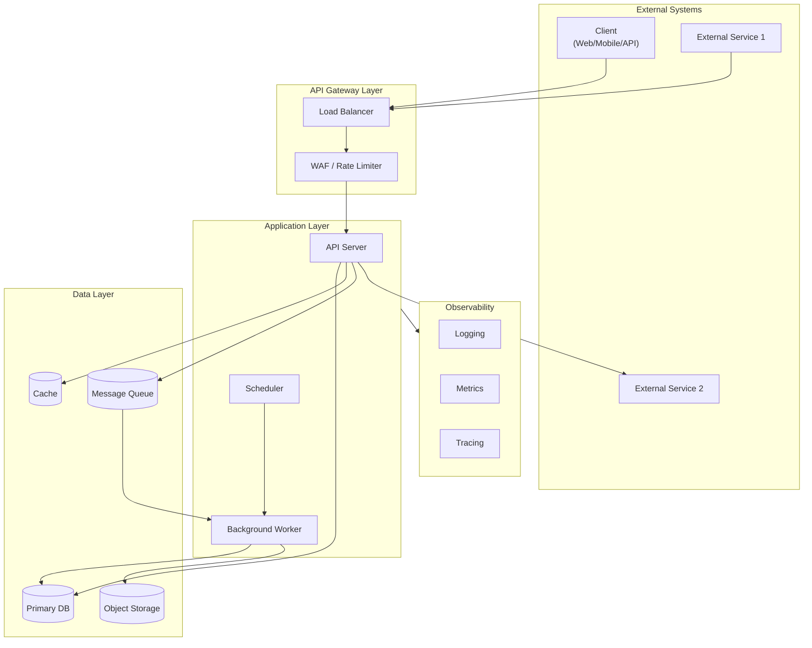
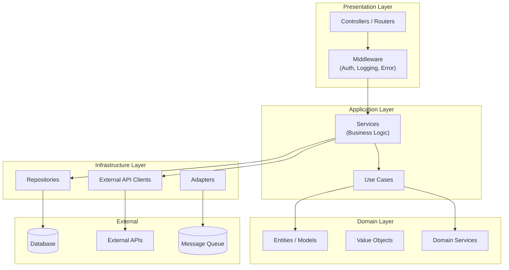
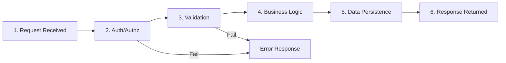
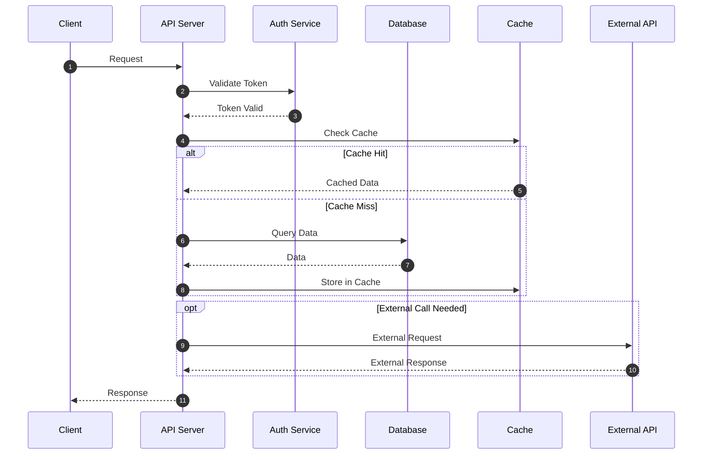
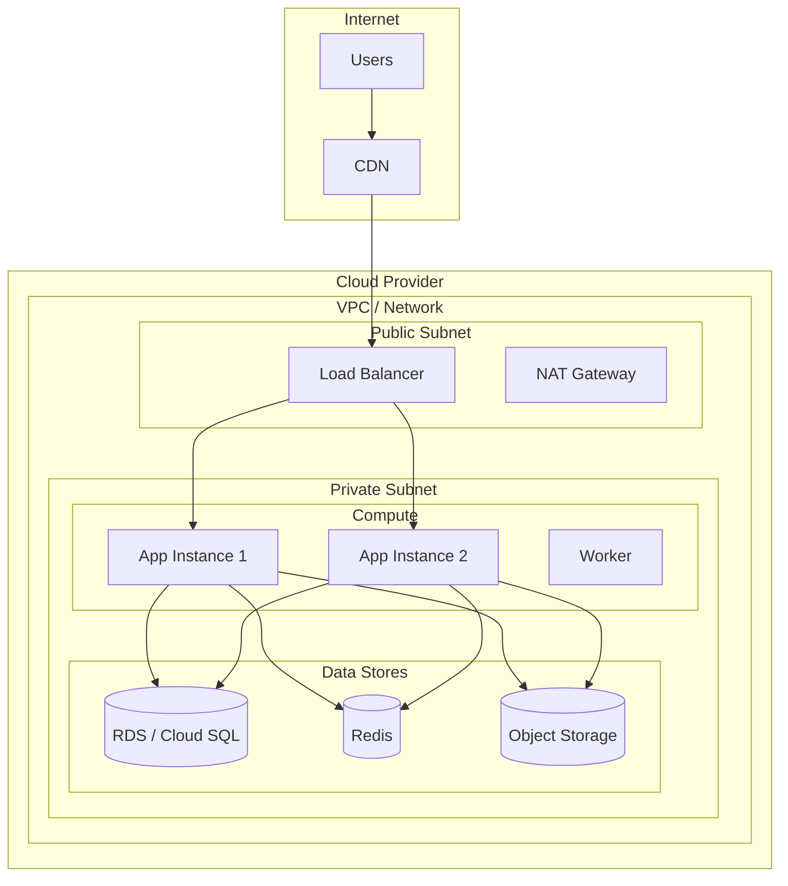
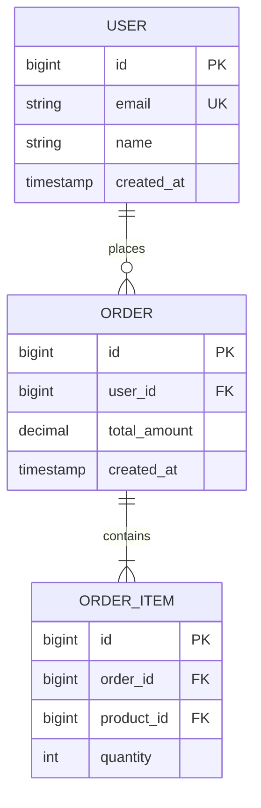
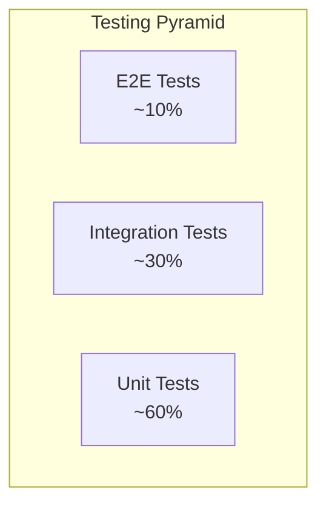
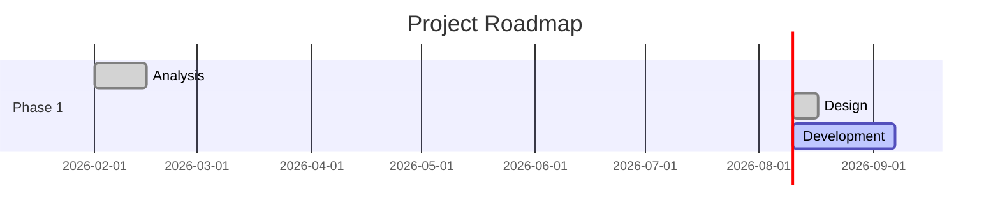

# PROJECT SPECIFICATION TEMPLATE (EN)

> **Template Version**: 1.0.0  
> **Last Updated**: 2026-03-24  
> **Based on**: Google PRD, Microsoft SDL, Apple HIG, AWS Well-Architected Framework

---

## How to Use This Template

### Usage

1. Copy this template to create a new project specification.
2. Replace placeholders like `[PROJECT_NAME]`, `[TODO]`, and `{Example}` with actual content.
3. Mark sections that are not applicable to your project as `N/A` or delete them.
4. Refer to the `💡 Writing Guide` in each section for content creation tips.

### Required Sections by Project Type

| Section | Web App | API/Backend | ML/AI | Data Pipeline | Library |
|------|:-------:|:-----------:|:-----:|:-------------:|:-------:|
| Executive Summary | ✅ | ✅ | ✅ | ✅ | ✅ |
| Problem & Goals | ✅ | ✅ | ✅ | ✅ | ✅ |
| Stakeholders | ✅ | ✅ | ✅ | ✅ | ⚪ |
| Functional Requirements | ✅ | ✅ | ✅ | ✅ | ✅ |
| Non-Functional Requirements | ✅ | ✅ | ✅ | ✅ | ✅ |
| System Architecture | ✅ | ✅ | ✅ | ✅ | ⚪ |
| Data Model | ✅ | ✅ | ✅ | ✅ | ⚪ |
| API Specification | ⚪ | ✅ | ⚪ | ⚪ | ✅ |
| Security & Privacy | ✅ | ✅ | ✅ | ✅ | ⚪ |
| Testing Strategy | ✅ | ✅ | ✅ | ✅ | ✅ |
| Observability | ✅ | ✅ | ✅ | ✅ | ⚪ |
| Deployment | ✅ | ✅ | ✅ | ✅ | ✅ |
| Risk Management | ✅ | ✅ | ✅ | ✅ | ⚪ |
| Responsible AI | ⚪ | ⚪ | ✅ | ⚪ | ⚪ |

✅ Required | ⚪ Optional/If Applicable

### Diagram Creation Guide

This template uses **Mermaid** syntax for creating diagrams.

- **Supported Environments**: GitHub, GitLab, Notion, VS Code (with extensions), Obsidian, etc.
- **Preview**: [Mermaid Live Editor](https://mermaid.live/)
- **Official Docs**: [Mermaid Documentation](https://mermaid.js.org/intro/)

---

# [PROJECT_NAME] - Project Specification

> **Version**: 0.1.0  
> **Created**: [YYYY-MM-DD]  
> **Last Updated**: [YYYY-MM-DD]  
> **Status**: Draft | In Review | Approved  
> **Owner**: [Owner Name]

---

## Table of Contents

1. [Executive Summary](#1-executive-summary)
2. [Problem Statement & Goals](#2-problem-statement--goals)
3. [Stakeholders & RACI](#3-stakeholders--raci)
4. [Functional Requirements](#4-functional-requirements)
5. [Non-Functional Requirements](#5-non-functional-requirements)
6. [System Architecture](#6-system-architecture)
7. [Data Model & Schema](#7-data-model--schema)
8. [API Specification](#8-api-specification)
9. [Security & Privacy](#9-security--privacy)
10. [Testing Strategy](#10-testing-strategy)
11. [Observability & Monitoring](#11-observability--monitoring)
12. [Deployment & Release](#12-deployment--release)
13. [Risk Management](#13-risk-management)
14. [Roadmap & Milestones](#14-roadmap--milestones)
15. [Glossary](#15-glossary)
16. [Revision History](#16-revision-history)
17. [Appendix](#17-appendix)

---

## 1. Executive Summary

> 💡 **Writing Guide**: Provide a concise overview of the project that can be understood in 5 minutes.

### 1.1 One-Line Project Definition

> [TODO] Define the core value of the project in one sentence.

```
{Example}
- "A knowledge search system that uses AI to search and generate answers from internal documents."
- "A microservices-based commerce platform for real-time order processing."
- "A data pipeline for collecting and analyzing IoT sensor data."
```

### 1.2 Core Value Proposition

| Target | Current Problem | Proposed Solution | Expected Impact |
|------|-----------|-------------|-----------|
| [User Group A] | [Problem] | [Solution] | [Quantitative Effect] |
| [User Group B] | [Problem] | [Solution] | [Quantitative Effect] |

### 1.3 Project Scope

#### In-Scope
- [ ] [Feature/Scope 1]
- [ ] [Feature/Scope 2]
- [ ] [Feature/Scope 3]

#### Out-of-Scope
- [ ] [Feature/Scope 1]
- [ ] [Feature/Scope 2]

#### Future Scope
- [ ] [Future Feature 1]
- [ ] [Future Feature 2]

### 1.4 Key Assumptions & Constraints

| Category | Content | Impact | Notes |
|------|------|:------:|------|
| **Assumptions** | [Assumption] | H/M/L | |
| **Constraints** | [Constraint] | H/M/L | |
| **Dependencies** | [External Dependency] | H/M/L | |

---

## 2. Problem Statement & Goals

> 💡 **Writing Guide**: Clearly answer "Why is this project necessary?".

### 2.1 Problem Statement

#### Current State (As-Is)

[TODO] Describe the current situation and problems in detail.

```
{Example}
Currently, the team is experiencing [Negative Result] due to [Problem Situation].
- Problem 1: [Detailed Description]
- Problem 2: [Detailed Description]
- Impact: [Business/Technical Impact]
```

#### Target State (To-Be)

[TODO] The desired state after project completion.

```
{Example}
Through this project, we expect to achieve [Target State] and [Positive Result].
- Goal 1: [Detailed Description]
- Goal 2: [Detailed Description]
```

### 2.2 Objectives & Success Metrics (OKR)

> 💡 **Writing Guide**: Set measurable goals. (SMART: Specific, Measurable, Achievable, Relevant, Time-bound)

#### Objective 1: [Objective Name]

| Key Result | Measurement Method | Current | Target | Deadline |
|------------|-----------|:----:|:----:|-----------|
| KR 1.1: [Key Result] | [Method] | [Value] | [Value] | [Date] |
| KR 1.2: [Key Result] | [Method] | [Value] | [Value] | [Date] |

#### Objective 2: [Objective Name]

| Key Result | Measurement Method | Current | Target | Deadline |
|------------|-----------|:----:|:----:|-----------|
| KR 2.1: [Key Result] | [Method] | [Value] | [Value] | [Date] |

### 2.3 Business Success Metrics (KPI)

| KPI | Definition | Measurement Cycle | Baseline | Target |
|-----|------|-----------|:------:|:----:|
| [KPI 1] | [Definition] | Daily/Weekly/Monthly | [Value] | [Value] |
| [KPI 2] | [Definition] | Daily/Weekly/Monthly | [Value] | [Value] |

---

## 3. Stakeholders & RACI

> 💡 **Writing Guide**: Identify all stakeholders and clarify their responsibilities.

### 3.1 Stakeholder Map

| Role | Name | Scope of Responsibility | Contact |
|------|--------|-----------|--------|
| **Product Owner** | [Name] | Requirement definition, prioritization | [Email] |
| **Tech Lead** | [Name] | Technical decisions, architecture design | [Email] |
| **Developer** | [Name] | Development and implementation | [Email] |
| **Designer** | [Name] | UI/UX design | [Email] |
| **QA** | [Name] | Test strategy/execution | [Email] |
| **SRE/DevOps** | [Name] | Infrastructure/deployment/monitoring | [Email] |
| **Sponsor** | [Name] | Budget/resource approval | [Email] |

### 3.2 RACI Matrix

> R: Responsible | A: Accountable | C: Consulted | I: Informed

| Activity | PO | Tech Lead | Dev | QA | SRE |
|------|:--:|:---------:|:---:|:--:|:---:|
| Requirement Definition | A | C | I | C | I |
| Architecture Design | C | A | R | I | C |
| Development | I | A | R | C | I |
| Code Review | I | A | R | I | I |
| Testing | C | C | R | A | I |
| Deployment | I | A | C | C | R |
| Monitoring | I | C | C | I | A |
| Incident Response | I | A | R | I | R |

### 3.3 Communication Plan

| Meeting/Channel | Purpose | Participants | Cycle | Output |
|-----------|------|--------|------|--------|
| Daily Standup | Status sharing | Dev Team | Daily | N/A |
| Sprint Planning | Plan next sprint | All | Bi-weekly | Sprint Backlog |
| Sprint Review | Demo results | All + Stakeholders | Bi-weekly | Demo |
| Retrospective | Reflect on sprint | Dev Team | Bi-weekly | Action Items |
| Technical Review | Tech decisions | Tech Lead + Dev | As needed | ADR |

---

## 4. Functional Requirements

> 💡 **Writing Guide**: Define functional requirements using User Stories.

### 4.1 Epic List

| Epic ID | Epic Name | Description | Priority | Status |
|---------|---------|------|:--------:|:----:|
| EP-001 | [Epic 1] | [Description] | P0 | 🔵 Planning |
| EP-002 | [Epic 2] | [Description] | P0 | ⚪ Backlog |
| EP-003 | [Epic 3] | [Description] | P1 | ⚪ Backlog |

> Status: ⚪ Backlog | 🔵 Planning | 🟢 In Progress | ✅ Done | ❌ Cancelled

### 4.2 User Stories

> 💡 **Format**: As a [Role], I want [Feature], So that [Value/Reason]

#### EP-001: [Epic Name]

---

##### US-001: [Story Title]

```
As a     [User Role]
I want   [Desired Feature]
So that  [Goal/Reason]
```

| Item | Content |
|------|------|
| **Priority** | P0 / P1 / P2 |
| **Story Points** | [Number] |
| **Dependencies** | [Story ID] |

**Acceptance Criteria:**
- [ ] [Condition 1]
- [ ] [Condition 2]
- [ ] [Condition 3]

**Technical Notes:**
- [Technical Considerations]
- [Implementation Hints]

---

##### US-002: [Story Title]

```
As a     [User Role]
I want   [Desired Feature]
So that  [Goal/Reason]
```

**Acceptance Criteria:**
- [ ] [Condition 1]
- [ ] [Condition 2]

---

### 4.3 Feature Matrix (Roadmap by Version)

| Feature | MVP | v1.1 | v1.2 | v2.0 |
|---------|:---:|:----:|:----:|:----:|
| [Feature 1] | ✅ | ✅ | ✅ | ✅ |
| [Feature 2] | ✅ | ✅ | ✅ | ✅ |
| [Feature 3] | ❌ | ✅ | ✅ | ✅ |
| [Feature 4] | ❌ | ❌ | ✅ | ✅ |
| [Feature 5] | ❌ | ❌ | ❌ | ✅ |

---

## 5. Non-Functional Requirements

> 💡 **Writing Guide**: Define system quality attributes. (Based on Google SRE, Microsoft SDL)

### 5.1 Quality Objectives Summary

| Area | Objective | Measurement Method |
|------|------|-----------|
| Availability | [e.g., 99.9%] | Uptime Monitoring |
| Response Latency | [e.g., p95 ≤ 200ms] | APM Metrics |
| Throughput | [e.g., 1000 TPS] | Load Testing |
| Scalability | [e.g., Handles 10x traffic] | Auto-scaling |

### 5.2 Quality Rubric (Out of 10)

| Area | Weight | Evaluation Criteria |
|------|:----:|-----------|
| Reliability/Performance | 2.5 | SLI/SLO/Error Budget, Performance Budget, Auto-scaling, Backpressure |
| Security/Privacy | 2.0 | SDL, Vulnerability Scanning, Secret/Key Management, Data Protection |
| API/Dev Experience | 1.5 | Consistency, Schema/Contract, Documentation, Versioning |
| Data Quality | 1.0 | Schema Contract, Data Validation, Freshness/Latency Visualization |
| Testing/Release | 1.0 | Static Analysis/Type/Coverage Gates, Canary/Rollback |
| Observability/Ops | 1.0 | Logs/Metrics/Traces, Golden Signals, Alerting Criteria |
| Responsible AI | 1.0 | (ML/AI only) Safety Guardrails/Evaluation/Audit |

### 5.3 SLI/SLO/Error Budget (Google SRE Principles)

> 💡 **Writing Guide**: Quantitatively define service level objectives.

#### Service Scope

- [Service 1]
- [Service 2]

#### SLO Definition (Monthly)

| SLO | Target | Error Budget |
|-----|:----:|----------|
| Availability | 99.9% | ≈ 43.2 min/month |
| Error Rate | < 0.5% | Based on HTTP 5xx |
| [Key API] Latency (p95) | ≤ [X]ms | - |
| [Key API] Latency (p99) | ≤ [X]ms | - |
| [Data Freshness] | ≤ [X]min | Source Change to Sync |

#### SLI Definition

| SLI | Measurement Method |
|-----|-----------|
| Latency | p50/p95/p99 histograms per endpoint |
| Error Rate | (Failed Requests / Total Requests) × 100 |
| Throughput | Requests per second (QPS/TPS) |
| Saturation | CPU/Memory/Connection/Queue utilization |

#### Alerting Rules

| Condition | Severity | Alert Target |
|------|:------:|-----------|
| Error Budget Burn Rate > 2%/hr | Warning | Slack |
| Error Budget Burn Rate > 10%/day | Critical | PagerDuty |
| p99 Latency > SLO (15m moving avg) | Warning | Slack |

### 5.4 Performance Budget

| Item | Budget | Notes |
|------|------|------|
| [Key Operation 1] | p95 ≤ [X]ms | |
| [Key Operation 2] | p95 ≤ [X]ms | |
| [Batch Processing] | ≤ [X]s/item | |
| Cache TTL | [X] min | Invalidation Rule: [Rule] |
| DB Connection Pool | max [X] | Timeout [X]s |

### 5.5 Responsible AI (ML/AI Projects Only)

> 💡 **Writing Guide**: Define ethical/safety requirements for AI systems.

| Area | Requirement |
|------|----------|
| **Safety** | Prompt injection/data extraction prevention, guardrails |
| **Policy** | Harmful content filter, citation, hallucination reduction |
| **Evaluation** | Benchmark sets, accuracy/safety scores, regression comparison |
| **Logging** | Prompt/Model Version/Feedback log retention |
| **Bias** | Fairness evaluation, bias monitoring |

---

## 6. System Architecture

> 💡 **Writing Guide**: Visualize the system structure from various perspectives. (C4 Model recommended)

### 6.1 High-Level Architecture

> 💡 **Writing Guide**: Show major system components and external integrations.



### 6.2 Component Diagram

> 💡 **Writing Guide**: Show internal layers/modules of the application.



### 6.3 Data Flow Diagram

#### 6.3.1 Main Flow (Flowchart)



#### 6.3.2 Detailed Sequence Diagram



### 6.4 Deployment Architecture



### 6.5 Technology Stack Summary

| Layer | Tech | Version | Purpose |
|------|------|------|------|
| **Language** | [Language] | [Version] | Main Language |
| **Framework** | [Framework] | [Version] | [Purpose] |
| **Database** | [DB] | [Version] | [Purpose] |
| **Cache** | [Cache] | [Version] | [Purpose] |
| **Queue** | [Queue] | [Version] | [Purpose] |
| **Container** | [Container] | [Version] | Containerization |
| **Orchestration** | [Orchestration] | [Version] | Deployment/Management |
| **CI/CD** | [CI/CD Tool] | - | Automation |
| **Monitoring** | [Monitoring] | - | Observability |

---

## 7. Data Model & Schema

### 7.1 Entity Relationship Diagram



---

## 8. API Specification

### 8.1 API Design Principles

| Principle | Implementation |
|------|------|
| Versioning | URL Path (`/api/v1/...`) |
| Resource-Oriented | Noun-based resources |
| Standard Methods | GET/POST/PUT/PATCH/DELETE |
| Error Model | Consistent JSON structure |

---

## 9. Security & Privacy

### 9.1 Security Framework

Complies with:
- [ ] OWASP Top 10
- [ ] Microsoft SDL

---

## 10. Testing Strategy

### 10.1 Testing Pyramid



---

## 11. Observability & Monitoring

### 11.1 Golden Signals

| Signal | Definition | Measurement |
|--------|------|-----------|
| **Latency** | Time to process request | p50/p95/p99 |
| **Traffic** | Request volume | QPS/TPS |
| **Errors** | Failure rate | 5xx Rate |
| **Saturation** | Resource fullness | CPU/Mem % |

---

## 12. Deployment & Release

### 12.1 Deployment Strategy

- **Strategy**: Canary Deployment (10% -> 30% -> 50% -> 100%)
- **Rollback Criteria**: Error rate increase > 5%

---

## 13. Risk Management

### 13.1 Risk Register

| ID | Risk | Impact | Probability | Strategy |
|----|------|:------:|:---------:|-----------|
| R-001 | [Risk 1] | H/M/L | H/M/L | [Mitigation] |

---

## 14. Roadmap & Milestones

### 14.1 Overall Roadmap



---

## 15. Glossary

| Term | Definition |
|------|------|
| [Term 1] | [Definition] |

---

## 16. Revision History

| Version | Date | Author | Changes |
|---------|------|--------|---------|
| 0.1.0 | 2026-03-24 | [Author] | Initial English Version |

---

## 17. Appendix

- Architecture Decision Records (ADR)
- Reference Material
- External Links
