# PROJECT SPECIFICATION TEMPLATE

> ⚠️ **DEPRECATED — 단일 거대(monolith) 1세대 템플릿입니다.**
> 단일 진실 출처(Source of Truth)는 모듈형 템플릿
> [`docs/`](../docs/PROJECT_SPECIFICATION.md) 으로 이전되었습니다.
> 신규 작성·수정은 모듈형 문서에서 진행하세요.
> 이 파일은 과거 이력 참고용으로만 보존합니다.

> **Template Version**: 1.0.0 (deprecated)  
> **Last Updated**: 2026-02-03  
> **Based on**: Google PRD, Microsoft SDL, Apple HIG, AWS Well-Architected Framework

---

## How to Use This Template

### 사용 방법

1. 이 템플릿을 복사하여 새 프로젝트 명세서 작성
2. `[PROJECT_NAME]`, `[TODO]`, `{예시}` 등의 플레이스홀더를 실제 내용으로 대체
3. 프로젝트 유형에 맞지 않는 섹션은 `N/A` 표시 또는 삭제
4. 각 섹션의 `💡 작성 가이드`를 참고하여 내용 작성

### 프로젝트 유형별 필수 섹션

| 섹션 | Web App | API/Backend | ML/AI | Data Pipeline | Library |
|------|:-------:|:-----------:|:-----:|:-------------:|:-------:|
| Executive Summary | ✅ | ✅ | ✅ | ✅ | ✅ |
| Problem & Goals | ✅ | ✅ | ✅ | ✅ | ✅ |
| Stakeholders | ✅ | ✅ | ✅ | ✅ | ⚪ |
| Functional Requirements | ✅ | ✅ | ✅ | ✅ | ✅ |
| Non-Functional Requirements | ✅ | ✅ | ✅ | ✅ | ✅ |
| System Architecture | ✅ | ✅ | ✅ | ✅ | ⚪ |
| Data Model | ✅ | ✅ | ✅ | ✅ | ⚪ |
| API Specification | ⚪ | ✅ | ⚪ | ⚪ | ✅ |
| Security & Privacy | ✅ | ✅ | ✅ | ✅ | ⚪ |
| Testing Strategy | ✅ | ✅ | ✅ | ✅ | ✅ |
| Observability | ✅ | ✅ | ✅ | ✅ | ⚪ |
| Deployment | ✅ | ✅ | ✅ | ✅ | ✅ |
| Risk Management | ✅ | ✅ | ✅ | ✅ | ⚪ |
| Responsible AI | ⚪ | ⚪ | ✅ | ⚪ | ⚪ |

✅ 필수 | ⚪ 선택/해당시

### 다이어그램 작성 가이드

본 템플릿은 **Mermaid** 문법을 사용하여 다이어그램을 작성합니다.

- **지원 환경**: GitHub, GitLab, Notion, VS Code (플러그인), Obsidian 등
- **미리보기**: [Mermaid Live Editor](https://mermaid.live/)
- **공식 문서**: [Mermaid Documentation](https://mermaid.js.org/intro/)

---

# [PROJECT_NAME] - Project Specification

> **Version**: 0.1.0  
> **Created**: [YYYY-MM-DD]  
> **Last Updated**: [YYYY-MM-DD]  
> **Status**: Draft | In Review | Approved  
> **Owner**: [담당자명]

---

## Table of Contents

1. [Executive Summary](#1-executive-summary)
2. [Problem Statement & Goals](#2-problem-statement--goals)
3. [Stakeholders & RACI](#3-stakeholders--raci)
4. [Functional Requirements](#4-functional-requirements)
5. [Non-Functional Requirements](#5-non-functional-requirements)
6. [System Architecture](#6-system-architecture)
7. [Data Model & Schema](#7-data-model--schema)
8. [API Specification](#8-api-specification)
9. [Security & Privacy](#9-security--privacy)
10. [Testing Strategy](#10-testing-strategy)
11. [Observability & Monitoring](#11-observability--monitoring)
12. [Deployment & Release](#12-deployment--release)
13. [Risk Management](#13-risk-management)
14. [Roadmap & Milestones](#14-roadmap--milestones)
15. [Glossary](#15-glossary)
16. [Revision History](#16-revision-history)
17. [Appendix](#17-appendix)

---

## 1. Executive Summary

> 💡 **작성 가이드**: 프로젝트의 핵심을 5분 안에 이해할 수 있도록 작성합니다.

### 1.1 프로젝트 한 줄 정의

> [TODO] 프로젝트의 핵심 가치를 한 문장으로 정의

```
{예시}
- "사내 문서를 AI로 검색하고 답변을 생성하는 지식 검색 시스템"
- "실시간 주문 처리를 위한 마이크로서비스 기반 커머스 플랫폼"
- "IoT 센서 데이터를 수집/분석하는 데이터 파이프라인"
```

### 1.2 핵심 가치 제안 (Value Proposition)

| 대상 | 현재 문제 | 제안 솔루션 | 기대 효과 |
|------|-----------|-------------|-----------|
| [사용자 그룹 A] | [문제점] | [솔루션] | [정량적 효과] |
| [사용자 그룹 B] | [문제점] | [솔루션] | [정량적 효과] |

### 1.3 프로젝트 범위 (Scope)

#### In-Scope (포함)
- [ ] [포함 기능/범위 1]
- [ ] [포함 기능/범위 2]
- [ ] [포함 기능/범위 3]

#### Out-of-Scope (제외)
- [ ] [제외 기능/범위 1]
- [ ] [제외 기능/범위 2]

#### Future Scope (향후 고려)
- [ ] [향후 기능 1]
- [ ] [향후 기능 2]

### 1.4 주요 가정 및 제약사항

| 구분 | 내용 | 영향도 | 비고 |
|------|------|:------:|------|
| **가정** | [가정 사항] | H/M/L | |
| **제약** | [제약 조건] | H/M/L | |
| **의존성** | [외부 의존성] | H/M/L | |

---

## 2. Problem Statement & Goals

> 💡 **작성 가이드**: "왜 이 프로젝트가 필요한가?"에 대한 명확한 답변을 제공합니다.

### 2.1 문제 정의 (Problem Statement)

#### 현재 상황 (As-Is)

[TODO] 현재 상황과 문제점을 구체적으로 기술

```
{작성 예시}
현재 팀은 [문제 상황]으로 인해 [부정적 결과]가 발생하고 있다.
- 문제 1: [구체적 설명]
- 문제 2: [구체적 설명]
- 영향: [비즈니스/기술적 영향]
```

#### 목표 상황 (To-Be)

[TODO] 프로젝트 완료 후 달성할 목표 상태

```
{작성 예시}
본 프로젝트를 통해 [목표 상태]를 달성하여 [긍정적 결과]를 기대한다.
- 목표 1: [구체적 설명]
- 목표 2: [구체적 설명]
```

### 2.2 목표 및 성공 지표 (OKR)

> 💡 **작성 가이드**: 측정 가능한 목표를 설정합니다. (SMART: Specific, Measurable, Achievable, Relevant, Time-bound)

#### Objective 1: [목표명]

| Key Result | 측정 방법 | 현재 | 목표 | 달성 기한 |
|------------|-----------|:----:|:----:|-----------|
| KR 1.1: [결과 지표] | [측정 방식] | [값] | [값] | [날짜] |
| KR 1.2: [결과 지표] | [측정 방식] | [값] | [값] | [날짜] |

#### Objective 2: [목표명]

| Key Result | 측정 방법 | 현재 | 목표 | 달성 기한 |
|------------|-----------|:----:|:----:|-----------|
| KR 2.1: [결과 지표] | [측정 방식] | [값] | [값] | [날짜] |

### 2.3 비즈니스 성공 지표 (KPI)

| KPI | 정의 | 측정 주기 | 기준선 | 목표 |
|-----|------|-----------|:------:|:----:|
| [KPI 1] | [정의] | Daily/Weekly/Monthly | [값] | [값] |
| [KPI 2] | [정의] | Daily/Weekly/Monthly | [값] | [값] |

---

## 3. Stakeholders & RACI

> 💡 **작성 가이드**: 프로젝트 관련 모든 이해관계자와 책임을 명확히 합니다.

### 3.1 이해관계자 맵

| 역할 | 담당자 | 책임 범위 | 연락처 |
|------|--------|-----------|--------|
| **Product Owner** | [이름] | 요구사항 정의, 우선순위 결정 | [이메일] |
| **Tech Lead** | [이름] | 기술 의사결정, 아키텍처 설계 | [이메일] |
| **Developer** | [이름] | 개발 및 구현 | [이메일] |
| **Designer** | [이름] | UI/UX 설계 | [이메일] |
| **QA** | [이름] | 테스트 전략/실행 | [이메일] |
| **SRE/DevOps** | [이름] | 인프라/배포/모니터링 | [이메일] |
| **Sponsor** | [이름] | 예산/리소스 승인 | [이메일] |

### 3.2 RACI Matrix

> R: Responsible (실행) | A: Accountable (최종책임) | C: Consulted (자문) | I: Informed (통보)

| 활동 | PO | Tech Lead | Dev | QA | SRE |
|------|:--:|:---------:|:---:|:--:|:---:|
| 요구사항 정의 | A | C | I | C | I |
| 아키텍처 설계 | C | A | R | I | C |
| 개발 | I | A | R | C | I |
| 코드 리뷰 | I | A | R | I | I |
| 테스트 | C | C | R | A | I |
| 배포 | I | A | C | C | R |
| 운영/모니터링 | I | C | C | I | A |
| 장애 대응 | I | A | R | I | R |

### 3.3 커뮤니케이션 계획

| 회의/채널 | 목적 | 참석자 | 주기 | 산출물 |
|-----------|------|--------|------|--------|
| Daily Standup | 진행 상황 공유 | 개발팀 | 매일 | N/A |
| Sprint Planning | 스프린트 계획 | 전체 | 격주 | Sprint Backlog |
| Sprint Review | 결과 데모 | 전체 + Stakeholder | 격주 | Demo |
| Retrospective | 회고 | 개발팀 | 격주 | Action Items |
| Technical Review | 기술 결정 | Tech Lead + Dev | 필요시 | ADR |

---

## 4. Functional Requirements

> 💡 **작성 가이드**: User Story 형식으로 기능 요구사항을 정의합니다.

### 4.1 Epic 목록

| Epic ID | Epic 명 | 설명 | 우선순위 | 상태 |
|---------|---------|------|:--------:|:----:|
| EP-001 | [Epic 1] | [설명] | P0 | 🔵 Planning |
| EP-002 | [Epic 2] | [설명] | P0 | ⚪ Backlog |
| EP-003 | [Epic 3] | [설명] | P1 | ⚪ Backlog |

> 상태: ⚪ Backlog | 🔵 Planning | 🟢 In Progress | ✅ Done | ❌ Cancelled

### 4.2 User Stories

> 💡 **작성 형식**: As a [역할], I want [기능], So that [이유/가치]

#### EP-001: [Epic 명]

---

##### US-001: [Story 제목]

```
As a     [사용자 역할]
I want   [원하는 기능]
So that  [달성하려는 가치/이유]
```

| 항목 | 내용 |
|------|------|
| **Priority** | P0 / P1 / P2 |
| **Story Points** | [숫자] |
| **Dependencies** | [의존 Story ID] |

**Acceptance Criteria:**
- [ ] [검증 조건 1]
- [ ] [검증 조건 2]
- [ ] [검증 조건 3]

**Technical Notes:**
- [기술적 고려사항]
- [구현 힌트]

---

##### US-002: [Story 제목]

```
As a     [사용자 역할]
I want   [원하는 기능]
So that  [달성하려는 가치/이유]
```

**Acceptance Criteria:**
- [ ] [검증 조건 1]
- [ ] [검증 조건 2]

---

### 4.3 Feature Matrix (버전별 기능 로드맵)

| Feature | MVP | v1.1 | v1.2 | v2.0 |
|---------|:---:|:----:|:----:|:----:|
| [기능 1] | ✅ | ✅ | ✅ | ✅ |
| [기능 2] | ✅ | ✅ | ✅ | ✅ |
| [기능 3] | ❌ | ✅ | ✅ | ✅ |
| [기능 4] | ❌ | ❌ | ✅ | ✅ |
| [기능 5] | ❌ | ❌ | ❌ | ✅ |

---

## 5. Non-Functional Requirements

> 💡 **작성 가이드**: 시스템의 품질 속성을 정의합니다. (Google SRE, Microsoft SDL 원칙 적용)

### 5.1 품질 목표 요약

| 영역 | 목표 | 측정 방법 |
|------|------|-----------|
| 가용성 | [예: 99.9%] | Uptime 모니터링 |
| 응답 지연 | [예: p95 ≤ 200ms] | APM 메트릭 |
| 처리량 | [예: 1000 TPS] | 부하 테스트 |
| 확장성 | [예: 10x 트래픽 대응] | 오토스케일링 |

### 5.2 품질 루브릭 (10점 만점)

| 영역 | 배점 | 평가 기준 |
|------|:----:|-----------|
| 신뢰성/성능 | 2.5 | SLI/SLO/에러버짓, 성능예산, 오토스케일, 백프레셔 |
| 보안/프라이버시 | 2.0 | SDL, 취약점 스캔, 시크릿/키관리, 데이터보호 |
| API/개발경험 | 1.5 | API 설계 일관성, 스키마/계약, 문서화, 버저닝 |
| 데이터 품질 | 1.0 | 스키마 계약, 데이터 검증, 신선도/지연 가시화 |
| 테스트/릴리즈 | 1.0 | 정적분석/타입/커버리지 게이트, 카나리/롤백 |
| 관측성/운영 | 1.0 | 로그/메트릭/트레이스, 골든 시그널, 알림 기준 |
| 책임있는 AI | 1.0 | (ML/AI 프로젝트만) 안전장치/평가/감사 |

### 5.3 SLI/SLO/에러버짓 (Google SRE 원칙)

> 💡 **작성 가이드**: 서비스 수준 목표를 정량적으로 정의합니다.

#### 서비스 범위

- [서비스 1]
- [서비스 2]

#### SLO 정의 (월간)

| SLO | 목표 | 에러버짓 |
|-----|:----:|----------|
| 가용성 | 99.9% | ≈ 43.2분/월 |
| 오류율 | < 0.5% | HTTP 5xx 기준 |
| [주요 API] 지연 (p95) | ≤ [X]ms | - |
| [주요 API] 지연 (p99) | ≤ [X]ms | - |
| [데이터 신선도] | ≤ [X]분 | 원본 변경→반영 |

#### SLI 정의

| SLI | 측정 방법 |
|-----|-----------|
| 지연 (Latency) | endpoint별 p50/p95/p99 히스토그램 |
| 오류율 (Error Rate) | (실패 요청 / 전체 요청) × 100 |
| 처리량 (Throughput) | 초당 요청 수 (QPS/TPS) |
| 포화도 (Saturation) | CPU/메모리/커넥션/큐 사용률 |

#### 알림 규칙

| 조건 | 심각도 | 알림 대상 |
|------|:------:|-----------|
| 에러버짓 번레이트 > 2%/시간 | Warning | Slack |
| 에러버짓 번레이트 > 10%/일 | Critical | PagerDuty |
| p99 지연 > SLO (15분 이동평균) | Warning | Slack |

### 5.4 성능 예산

| 항목 | 예산 | 비고 |
|------|------|------|
| [주요 작업 1] | p95 ≤ [X]ms | |
| [주요 작업 2] | p95 ≤ [X]ms | |
| [배치 처리] | ≤ [X]s/건 | |
| 캐시 TTL | [X]분 | 무효화 조건: [조건] |
| DB 커넥션 풀 | max [X] | 타임아웃 [X]s |

### 5.5 책임있는 AI (ML/AI 프로젝트만 해당)

> 💡 **작성 가이드**: AI 시스템의 윤리적/안전 요구사항을 정의합니다.

| 영역 | 요구사항 |
|------|----------|
| **안전** | 프롬프트 인젝션/데이터 추출 방지, 가드레일 |
| **정책** | 유해 콘텐츠 필터, 출처 인용, 환각 감축 |
| **평가** | 벤치마크 셋, 정확성/안전성 점수, 회귀 비교 |
| **기록** | 프롬프트/모델버전/피드백 로그 보관 |
| **편향** | 공정성 평가, 편향 모니터링 |

---

## 6. System Architecture

> 💡 **작성 가이드**: 시스템 구조를 다양한 관점에서 시각화합니다. (C4 Model 권장)
> 
> **Mermaid 사용**: 아래 다이어그램은 Mermaid 문법으로 작성되어 있습니다. GitHub, GitLab, Notion 등에서 자동 렌더링됩니다.

### 6.1 High-Level Architecture

> 💡 **작성 가이드**: 전체 시스템의 주요 구성요소와 외부 시스템 연동을 표현합니다.

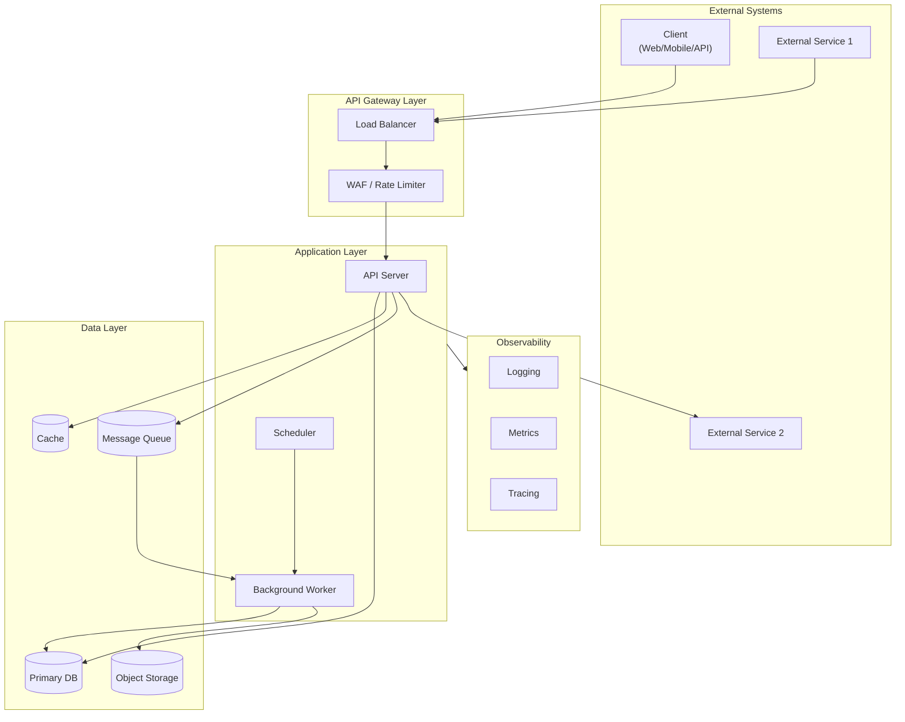

**{예시 - 마이크로서비스 아키텍처}**

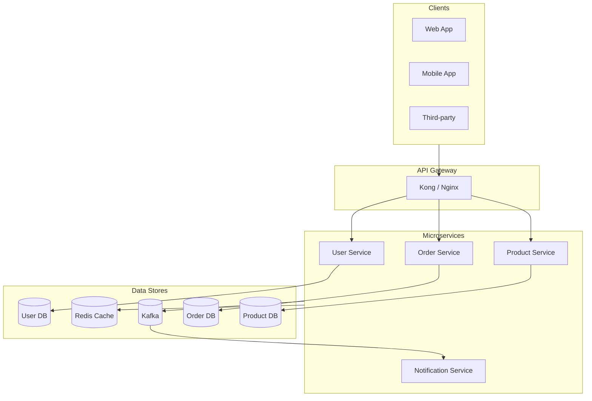

### 6.2 Component Diagram

> 💡 **작성 가이드**: 애플리케이션 내부의 레이어/모듈 구조를 표현합니다.

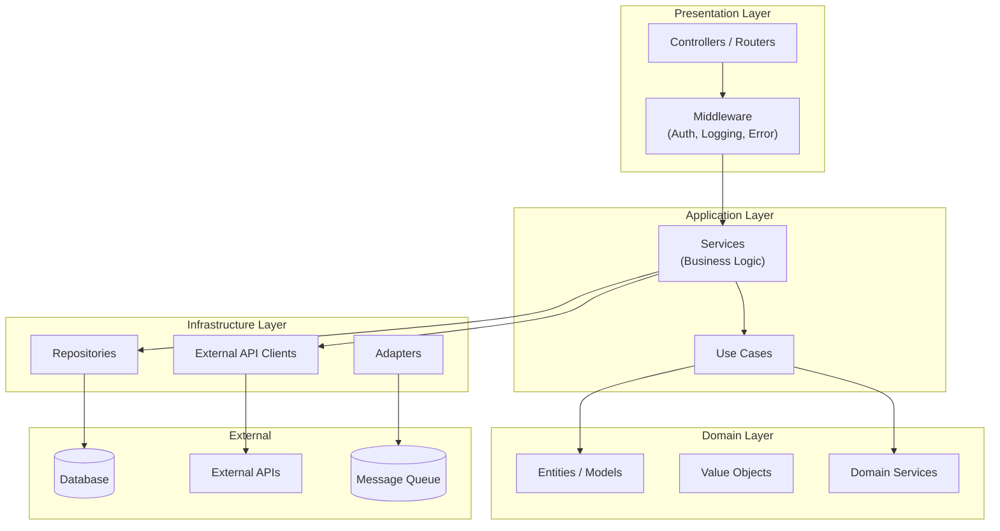

### 6.3 Data Flow Diagram

> 💡 **작성 가이드**: 주요 데이터의 흐름을 시퀀스 또는 플로우차트로 표현합니다.

#### 6.3.1 주요 플로우 (Flowchart)

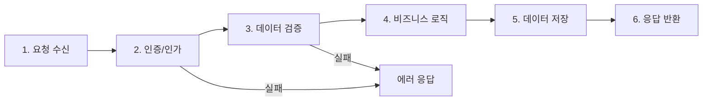

#### 6.3.2 상세 시퀀스 (Sequence Diagram)

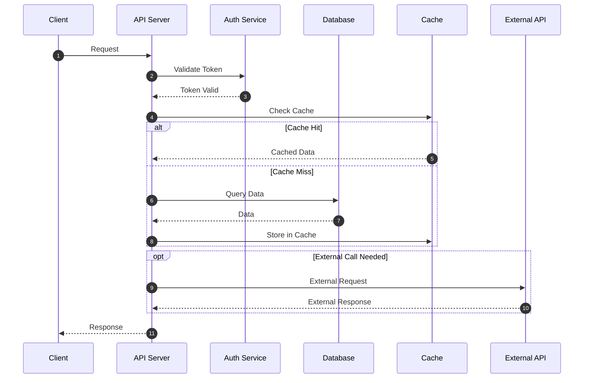

**{예시 - 데이터 파이프라인 플로우}**

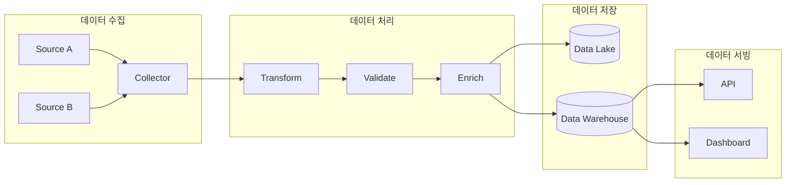

### 6.4 Deployment Architecture

> 💡 **작성 가이드**: 인프라 배포 구조를 표현합니다.

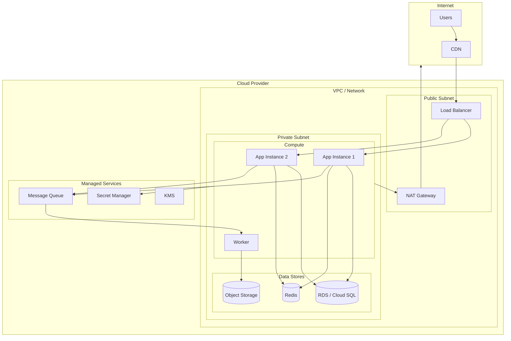

**{예시 - Kubernetes 배포}**

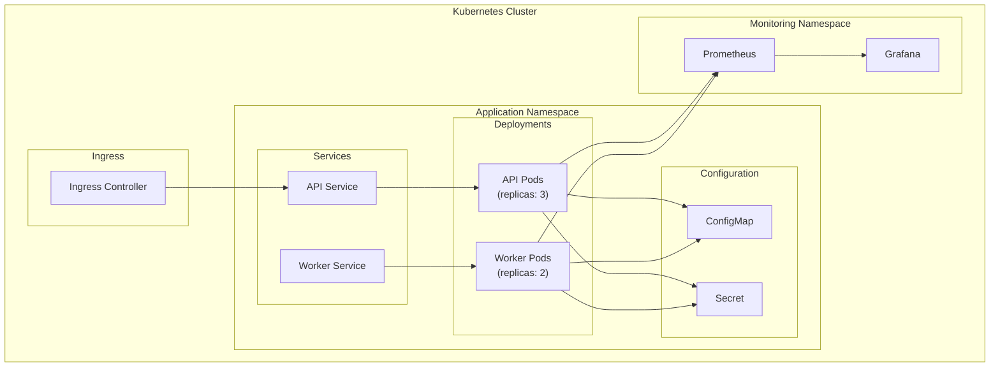

### 6.5 기술 스택 요약

| 계층 | 기술 | 버전 | 용도 |
|------|------|------|------|
| **Language** | [언어] | [버전] | 주 개발 언어 |
| **Framework** | [프레임워크] | [버전] | [용도] |
| **Database** | [DB] | [버전] | [용도] |
| **Cache** | [캐시] | [버전] | [용도] |
| **Queue** | [큐] | [버전] | [용도] |
| **Container** | [컨테이너] | [버전] | 컨테이너화 |
| **Orchestration** | [오케스트레이션] | [버전] | 배포/관리 |
| **CI/CD** | [CI/CD 도구] | - | 빌드/배포 자동화 |
| **Monitoring** | [모니터링] | - | 관측성 |

---

## 7. Data Model & Schema

> 💡 **작성 가이드**: 데이터 구조와 관계를 정의합니다.

### 7.1 Entity Relationship Diagram

> 💡 **작성 가이드**: Mermaid erDiagram을 사용하여 ERD를 작성합니다.

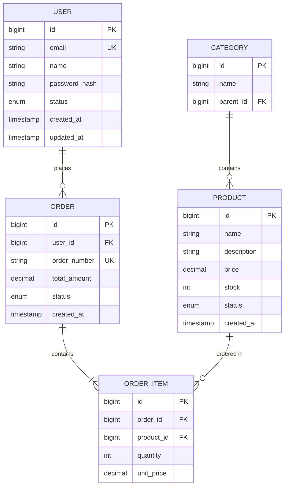

**{예시 - 간단한 ERD}**

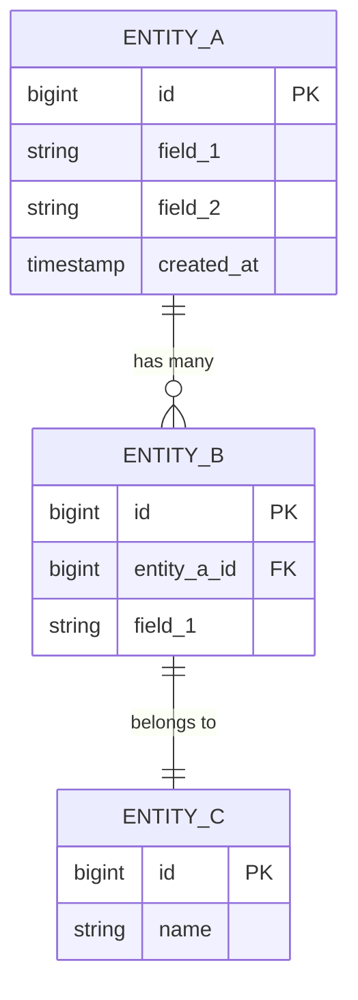

### 7.2 테이블/컬렉션 스키마 상세

#### [Entity 명] 테이블

```sql
-- {예시: SQL DDL}
CREATE TABLE [table_name] (
    id              BIGINT PRIMARY KEY AUTO_INCREMENT,
    [field_1]       VARCHAR(255) NOT NULL,
    [field_2]       TEXT,
    [status]        ENUM('active', 'inactive') DEFAULT 'active',
    created_at      TIMESTAMP DEFAULT CURRENT_TIMESTAMP,
    updated_at      TIMESTAMP DEFAULT CURRENT_TIMESTAMP ON UPDATE CURRENT_TIMESTAMP,
    
    INDEX idx_[field_1] ([field_1]),
    INDEX idx_created_at (created_at)
) ENGINE=InnoDB DEFAULT CHARSET=utf8mb4;
```

| 컬럼 | 타입 | 필수 | 설명 |
|------|------|:----:|------|
| id | BIGINT | ✅ | Primary Key |
| [field_1] | VARCHAR(255) | ✅ | [설명] |
| [field_2] | TEXT | ❌ | [설명] |

### 7.3 데이터 라이프사이클

| 데이터 유형 | 보존 기간 | 삭제 조건 | 백업 주기 |
|-------------|-----------|-----------|-----------|
| [유형 1] | 영구 | 명시적 요청 | Daily |
| [유형 2] | 90일 | TTL 자동 삭제 | N/A |
| [유형 3] | 1년 | 연간 정리 | Weekly |

### 7.4 데이터 마이그레이션 전략

- 마이그레이션 도구: [Alembic / Flyway / 등]
- 후방 호환성: [정책]
- 롤백 전략: [전략]

---

## 8. API Specification

> 💡 **작성 가이드**: [Google API Design Guide](https://cloud.google.com/apis/design) 원칙을 따릅니다.

### 8.1 API 설계 원칙

| 원칙 | 적용 |
|------|------|
| 버저닝 | URL Path (`/api/v1/...`) |
| 리소스 지향 | 명사형 리소스 |
| 표준 메서드 | GET/POST/PUT/PATCH/DELETE |
| 에러 모델 | 일관된 JSON 구조 |
| 페이지네이션 | `limit`, `offset` 또는 `cursor` |
| 멱등성 | `Idempotency-Key` 헤더 지원 |

### 8.2 Base URL

| 환경 | URL |
|------|-----|
| Production | `https://api.example.com/api/v1` |
| Staging | `https://api-staging.example.com/api/v1` |
| Development | `http://localhost:8000/api/v1` |

### 8.3 인증/인가

```http
Authorization: Bearer <access_token>
```

| 인증 방식 | 용도 |
|-----------|------|
| OAuth 2.0 / JWT | 사용자 인증 |
| API Key | 서비스 간 통신 |

### 8.4 공통 헤더

| 헤더 | 필수 | 설명 |
|------|:----:|------|
| `Authorization` | ✅ | 인증 토큰 |
| `Content-Type` | ✅ | `application/json` |
| `X-Request-ID` | ❌ | 요청 추적 ID |
| `Idempotency-Key` | ❌ | POST 멱등성 키 |

### 8.5 에러 응답 모델

```json
{
    "error": {
        "code": "ERROR_CODE",
        "message": "Human-readable message",
        "details": [
            {
                "field": "field_name",
                "reason": "validation error reason"
            }
        ],
        "request_id": "req_xxx"
    }
}
```

#### 에러 코드 목록

| HTTP Status | Code | 설명 |
|-------------|------|------|
| 400 | `VALIDATION_ERROR` | 요청 데이터 검증 실패 |
| 400 | `INVALID_PARAMETER` | 잘못된 파라미터 |
| 401 | `UNAUTHORIZED` | 인증 필요 |
| 403 | `FORBIDDEN` | 권한 없음 |
| 404 | `NOT_FOUND` | 리소스 없음 |
| 409 | `CONFLICT` | 리소스 충돌 |
| 429 | `RATE_LIMIT_EXCEEDED` | 요청 한도 초과 |
| 500 | `INTERNAL_ERROR` | 서버 내부 오류 |
| 503 | `SERVICE_UNAVAILABLE` | 서비스 일시 불가 |

### 8.6 Endpoints

> 💡 **작성 가이드**: 각 엔드포인트를 상세히 문서화합니다.

---

#### `[METHOD] /api/v1/[resource]`

[API 설명]

**Request:**

```json
{
    "field_1": "value",
    "field_2": 123
}
```

| 필드 | 타입 | 필수 | 기본값 | 설명 |
|------|------|:----:|--------|------|
| `field_1` | string | ✅ | - | [설명] |
| `field_2` | integer | ❌ | 10 | [설명] |

**Response (200 OK):**

```json
{
    "data": {
        "id": "xxx",
        "field_1": "value"
    },
    "meta": {
        "request_id": "req_xxx"
    }
}
```

---

### 8.7 Rate Limiting

| 엔드포인트 | 제한 | 윈도우 |
|------------|:----:|--------|
| 기본 | 100 req | 1분 |
| [고비용 API] | 10 req | 1분 |

**Rate Limit 응답 헤더:**

```http
X-RateLimit-Limit: 100
X-RateLimit-Remaining: 45
X-RateLimit-Reset: 1706961600
```

---

## 9. Security & Privacy

> 💡 **작성 가이드**: Microsoft SDL(Security Development Lifecycle) 원칙을 적용합니다.

### 9.1 보안 프레임워크

본 프로젝트는 다음 보안 표준/프레임워크를 준수합니다:
- [ ] OWASP Top 10
- [ ] Microsoft SDL
- [ ] [기타 규정: GDPR, HIPAA, 등]

### 9.2 위협 모델 (STRIDE)

| 위협 유형 | 대상 영역 | 위협 시나리오 | 완화 방안 |
|-----------|-----------|---------------|-----------|
| **S**poofing | 인증 | [시나리오] | [완화책] |
| **T**ampering | API | [시나리오] | [완화책] |
| **R**epudiation | 감사 | [시나리오] | [완화책] |
| **I**nfo Disclosure | 데이터 | [시나리오] | [완화책] |
| **D**oS | 서버 | [시나리오] | [완화책] |
| **E**levation | 권한 | [시나리오] | [완화책] |

### 9.3 인증/인가

| 항목 | 구현 |
|------|------|
| 인증 방식 | [OAuth 2.0, JWT, 등] |
| 토큰 만료 | Access: [X]시간, Refresh: [X]일 |
| 권한 모델 | [RBAC / ABAC] |
| MFA | [지원 여부] |

### 9.4 데이터 보호

| 구분 | 적용 |
|------|------|
| 전송 암호화 | TLS 1.2+ 필수 |
| 저장 암호화 | [암호화 방식] |
| 키 관리 | [KMS 서비스] |
| 시크릿 관리 | [Secret Manager] |

### 9.5 보안 검사 도구

| 도구 | 용도 | 실행 시점 |
|------|------|-----------|
| [SAST 도구] | 정적 분석 | Pre-commit, CI |
| [Dependency Scanner] | 종속성 취약점 | Daily, PR |
| [Container Scanner] | 이미지 스캔 | Build |
| [Secret Scanner] | 시크릿 유출 | Pre-commit |

### 9.6 데이터 분류 및 프라이버시

| 분류 | 정의 | 예시 | 보존 기간 | 접근 권한 |
|------|------|------|-----------|-----------|
| **Public** | 공개 가능 | [예시] | 영구 | 전체 |
| **Internal** | 사내 공유 | [예시] | [기간] | 팀원 |
| **Confidential** | 제한 공유 | [예시] | [기간] | 담당자 |
| **Restricted** | 엄격 제한 | [예시] | 최소 | 시스템 |

### 9.7 로그 민감정보 마스킹

마스킹 대상:
- [ ] 이메일 주소
- [ ] 전화번호
- [ ] API 키/토큰
- [ ] 비밀번호
- [ ] 개인식별정보 (PII)

---

## 10. Testing Strategy

> 💡 **작성 가이드**: 테스트 피라미드 원칙에 따라 전략을 수립합니다.

### 10.1 테스트 피라미드

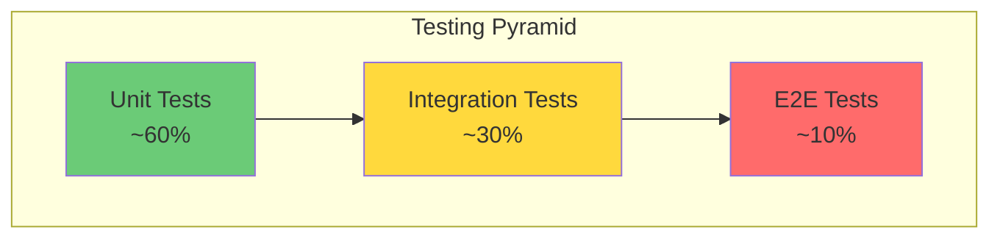

### 10.2 테스트 유형별 전략

| 유형 | 도구 | 커버리지 목표 | 실행 시점 |
|------|------|:-------------:|-----------|
| Unit Test | [pytest/jest/등] | ≥ 80% | Pre-commit, PR |
| Integration Test | [도구] | 주요 플로우 | PR, Daily |
| Contract Test | [도구] | API 100% | PR |
| E2E Test | [Playwright/Cypress] | Critical Path | Daily |
| Load Test | [k6/Locust] | SLO 검증 | Weekly |
| Security Test | [도구] | - | Weekly |

### 10.3 품질 게이트 (CI Pipeline)

```yaml
quality_gate:
  - name: Type Check
    tool: [pyright/tsc/등]
    threshold: 0 errors
    
  - name: Lint
    tool: [ruff/eslint/등]
    threshold: 0 errors
    
  - name: Security
    tool: [bandit/snyk/등]
    threshold: 0 high/critical
    
  - name: Coverage
    tool: [pytest-cov/jest/등]
    threshold: ≥ 80%
    trend: non-decreasing
```

### 10.4 테스트 환경

| 환경 | 용도 | 데이터 |
|------|------|--------|
| Local | 개발자 테스트 | Mock/Fixture |
| CI | 자동화 테스트 | Testcontainers |
| Staging | 통합/E2E | 익명화된 샘플 |

### 10.5 성능 테스트 시나리오

```yaml
# {예시}
scenarios:
  - name: [시나리오명]
    endpoint: [METHOD] [PATH]
    vus: [동시 사용자 수]
    duration: [테스트 시간]
    thresholds:
      http_req_duration: ['p95<[X]', 'p99<[X]']
      http_req_failed: ['rate<0.01']
```

---

## 11. Observability & Monitoring

> 💡 **작성 가이드**: Google SRE의 골든 시그널을 기반으로 관측성을 설계합니다.

### 11.1 골든 시그널 (Four Golden Signals)

| 시그널 | 정의 | 측정 방법 | 알림 기준 |
|--------|------|-----------|-----------|
| **Latency** | 요청 처리 시간 | p50/p95/p99 | p95 > SLO |
| **Traffic** | 요청량 | QPS/TPS | 급격한 변화 |
| **Errors** | 오류율 | 5xx / 전체 | > [X]% |
| **Saturation** | 리소스 포화도 | CPU/Mem/Conn | > 80% |

### 11.2 로깅 전략

#### 로그 포맷 (구조화 JSON)

```json
{
    "timestamp": "2026-02-03T10:15:30.123Z",
    "level": "INFO",
    "service": "[service_name]",
    "trace_id": "abc123",
    "span_id": "def456",
    "message": "[log message]",
    "context": {
        "[key]": "[value]"
    }
}
```

#### 로그 레벨 가이드

| 레벨 | 용도 | 예시 |
|------|------|------|
| ERROR | 즉시 조치 필요 | DB 연결 실패, 외부 API 오류 |
| WARN | 주의 필요 | 재시도 발생, 임계치 근접 |
| INFO | 정상 운영 기록 | 요청 완료, 작업 완료 |
| DEBUG | 개발/디버깅 | 상세 실행 흐름 |

### 11.3 메트릭

#### 애플리케이션 메트릭

| 메트릭 명 | 타입 | 라벨 | 설명 |
|-----------|------|------|------|
| `http_requests_total` | Counter | method, path, status | 총 요청 수 |
| `http_request_duration_seconds` | Histogram | method, path | 요청 지연 |
| `[custom_metric]` | [타입] | [라벨] | [설명] |

#### 인프라 메트릭

| 메트릭 | 소스 | 알림 임계치 |
|--------|------|-------------|
| CPU 사용률 | [소스] | > 80% |
| 메모리 사용률 | [소스] | > 85% |
| 디스크 사용률 | [소스] | > 90% |
| 커넥션 수 | [소스] | > 80% of max |

### 11.4 분산 추적 (Tracing)

추적 전파 헤더:
- `X-Request-ID`: 클라이언트 → 백엔드
- `traceparent`: W3C Trace Context (OpenTelemetry)

### 11.5 대시보드 구성

| 대시보드 | 포함 내용 | 대상 |
|----------|-----------|------|
| **Overview** | SLO 현황, 트래픽, 에러율 | 전체 |
| **Performance** | 지연, 처리량 | Backend |
| **Infrastructure** | 리소스 사용량 | SRE |
| **Cost** | 비용 현황 | 관리자 |

### 11.6 알림 정책

| 심각도 | 조건 | 알림 채널 | 대응 시간 |
|--------|------|-----------|-----------|
| **Critical** | 서비스 다운, SLO 위반 | PagerDuty + Slack | 15분 |
| **Warning** | 임계치 근접, 이상 패턴 | Slack | 1시간 |
| **Info** | 배포 완료, 정기 리포트 | Slack | N/A |

---

## 12. Deployment & Release

> 💡 **작성 가이드**: 안전하고 신뢰할 수 있는 배포 전략을 정의합니다.

### 12.1 배포 전략

#### 카나리 배포 (Canary)

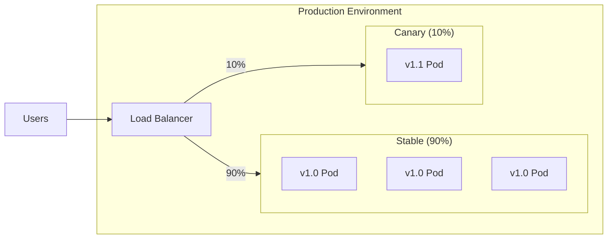

**배포 단계:**

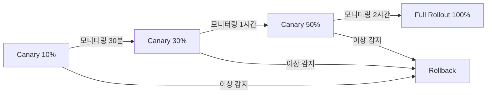

#### 대안 전략

| 전략 | 설명 | 사용 시기 |
|------|------|-----------|
| Blue-Green | 전체 교체, 빠른 롤백 | 대규모 변경 |
| Rolling | 점진적 인스턴스 교체 | 일반 배포 |
| Feature Flag | 기능 단위 제어 | 실험, A/B 테스트 |

### 12.2 롤백 기준

| 조건 | 임계치 | 자동 롤백 |
|------|--------|:---------:|
| 에러율 증가 | > [X]% (baseline 대비) | ✅/❌ |
| p95 지연 증가 | > [X]% (baseline 대비) | ✅/❌ |
| SLO 번레이트 | > [X]%/시간 | ✅/❌ |
| Health Check 실패 | > [X]% | ✅/❌ |

### 12.3 환경 구성

| 환경 | 용도 | 자동 배포 | 승인 필요 |
|------|------|:---------:|:---------:|
| Development | 개발/테스트 | ✅ | ❌ |
| Staging | 통합 테스트 | ✅ | ❌ |
| Production | 운영 | ❌ | ✅ |

### 12.4 CI/CD Pipeline

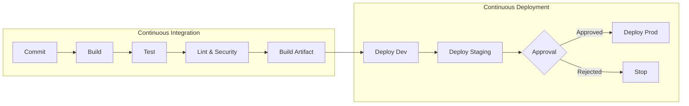

### 12.5 공급망 보안

| 항목 | 구현 | 도구 |
|------|------|------|
| SBOM 생성 | 빌드 시 생성 | [syft/등] |
| 종속성 고정 | Lock 파일 사용 | [pip-tools/yarn/등] |
| 이미지 서명 | 서명 및 검증 | [cosign/등] |
| 취약점 스캔 | 빌드/배포 시 | [trivy/snyk/등] |

### 12.6 마이그레이션 가이드

**DB 마이그레이션 원칙:**
1. 후방 호환성 유지 ([X]버전)
2. 드라이런 필수 실행
3. 롤백 스크립트 준비
4. 피크 시간 외 실행

---

## 13. Risk Management

> 💡 **작성 가이드**: 프로젝트 위험을 사전에 식별하고 완화 전략을 수립합니다.

### 13.1 위험 등록부 (Risk Register)

| ID | 위험 | 영향도 | 발생 확률 | 위험 점수 | 완화 전략 | 담당자 |
|----|------|:------:|:---------:|:---------:|-----------|--------|
| R-001 | [위험 1] | H/M/L | H/M/L | 🔴/🟠/🟡/🟢 | [전략] | [담당] |
| R-002 | [위험 2] | H/M/L | H/M/L | 🔴/🟠/🟡/🟢 | [전략] | [담당] |

### 13.2 위험 점수 매트릭스

```mermaid
quadrantChart
    title Risk Matrix
    x-axis Low Impact --> High Impact
    y-axis Low Probability --> High Probability
    quadrant-1 High Risk (Mitigate)
    quadrant-2 Medium Risk (Monitor)
    quadrant-3 Low Risk (Accept)
    quadrant-4 Medium Risk (Transfer)
```

> **참고**: 위험 점수 = 영향도 × 발생 확률
> - 🔴 High (6-9): 즉시 대응 필요
> - 🟠 Medium (3-5): 완화 계획 수립
> - 🟡 Low (1-2): 모니터링
> - 🟢 Minimal: 수용

### 13.3 비상 대응 계획 (Contingency Plan)

#### 시나리오: [주요 장애 시나리오]

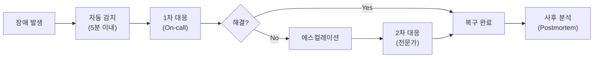

**대응 절차:**
1. [절차 1]
2. [절차 2]
3. [절차 3]

### 13.4 의존성 위험

| 의존성 | 위험 수준 | 대안 | 전환 비용 |
|--------|:---------:|------|:---------:|
| [의존성 1] | 🟠/🟡/🟢 | [대안] | H/M/L |
| [의존성 2] | 🟠/🟡/🟢 | [대안] | H/M/L |

---

## 14. Roadmap & Milestones

> 💡 **작성 가이드**: 프로젝트 일정과 마일스톤을 정의합니다.

### 14.1 전체 로드맵

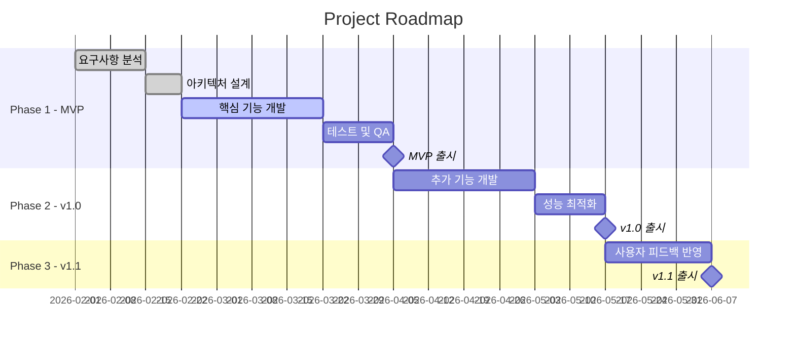

**{예시 - 간단한 로드맵}**

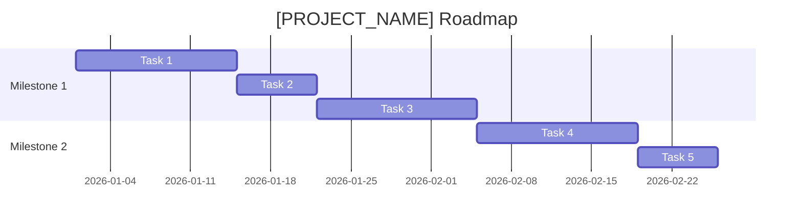

### 14.2 마일스톤 상세

#### Milestone 1: [마일스톤 명] (목표일: [YYYY-MM-DD])

| Phase | Task | Owner | 상태 |
|:-----:|------|-------|:----:|
| 1 | [태스크 1] | [담당] | ⚪/🔵/🟢/✅ |
| 2 | [태스크 2] | [담당] | ⚪/🔵/🟢/✅ |
| 3 | [태스크 3] | [담당] | ⚪/🔵/🟢/✅ |

> 상태: ⚪ Not Started | 🔵 Planning | 🟢 In Progress | ✅ Done

**완료 기준 (Definition of Done):**
- [ ] [기준 1]
- [ ] [기준 2]
- [ ] [기준 3]

### 14.3 의존관계 다이어그램

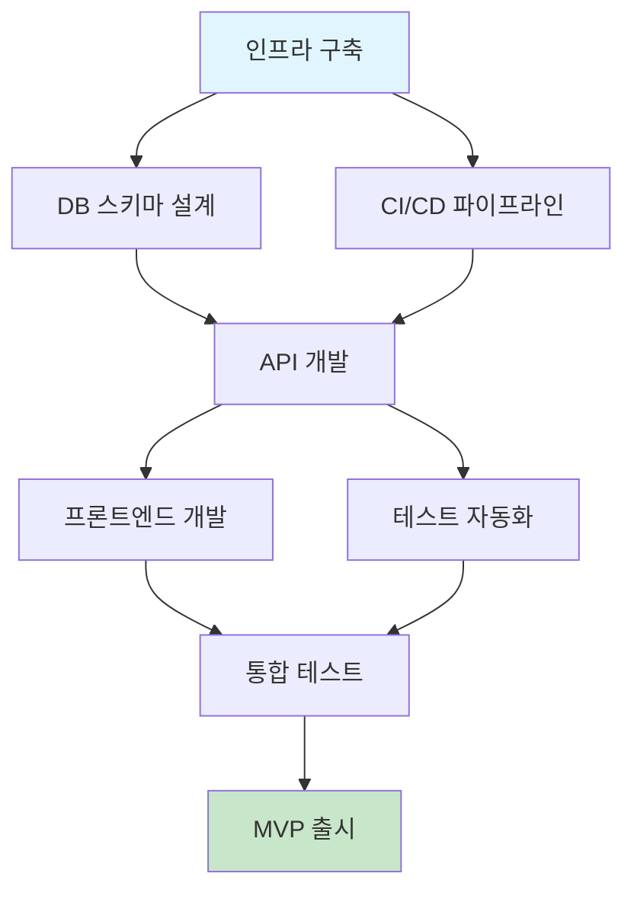

---

## 15. Glossary

> 💡 **작성 가이드**: 프로젝트에서 사용하는 용어를 정의합니다.

| 용어 | 정의 | 관련 섹션 |
|------|------|-----------|
| [용어 1] | [정의] | [섹션] |
| [용어 2] | [정의] | [섹션] |
| [용어 3] | [정의] | [섹션] |

### 약어 목록

| 약어 | 전체 명칭 |
|------|-----------|
| SLI | Service Level Indicator |
| SLO | Service Level Objective |
| SLA | Service Level Agreement |
| RBAC | Role-Based Access Control |
| CI/CD | Continuous Integration / Continuous Deployment |
| [약어] | [전체 명칭] |

---

## 16. Revision History

| Version | Date | Author | Changes |
|---------|------|--------|---------|
| 0.1.0 | [YYYY-MM-DD] | [작성자] | 초안 작성 |
| | | | - [변경사항 1] |
| | | | - [변경사항 2] |

---

## 17. Appendix

### A. Architecture Decision Records (ADR)

> 💡 **작성 가이드**: 중요한 기술 결정을 기록합니다.

#### ADR-001: [결정 제목]

| 항목 | 내용 |
|------|------|
| **상태** | Proposed / Accepted / Deprecated / Superseded |
| **컨텍스트** | [결정이 필요한 배경] |
| **결정** | [선택한 방안] |
| **근거** | [선택 이유] |
| **대안 검토** | [검토한 대안들] |
| **결과** | [예상 결과/영향] |

### B. 참고 자료

- [Google API Design Guide](https://cloud.google.com/apis/design)
- [Google SRE Book](https://sre.google/sre-book/table-of-contents/)
- [Microsoft SDL](https://www.microsoft.com/en-us/securityengineering/sdl)
- [OWASP Top 10](https://owasp.org/www-project-top-ten/)
- [AWS Well-Architected Framework](https://aws.amazon.com/architecture/well-architected/)
- [12 Factor App](https://12factor.net/)
- [Mermaid Documentation](https://mermaid.js.org/intro/)

### C. 관련 문서 링크

| 문서 | 위치 | 설명 |
|------|------|------|
| API 문서 | [링크] | OpenAPI 스펙 |
| 운영 플레이북 | [링크] | 장애 대응 가이드 |
| 온보딩 가이드 | [링크] | 신규 팀원 가이드 |

### D. Mermaid 다이어그램 가이드

본 템플릿에서 사용된 Mermaid 다이어그램 유형:

| 다이어그램 | 용도 | 문법 |
|------------|------|------|
| Flowchart | 시스템 구조, 데이터 플로우 | `flowchart TB/LR` |
| Sequence | API 호출 시퀀스 | `sequenceDiagram` |
| ERD | 데이터 모델 | `erDiagram` |
| Gantt | 일정/로드맵 | `gantt` |
| Quadrant | 위험 매트릭스 | `quadrantChart` |

**미리보기 도구**: [Mermaid Live Editor](https://mermaid.live/)

### E. 템플릿 변경 이력

| Version | Date | Changes |
|---------|------|---------|
| 1.0.0 | 2026-02-03 | 템플릿 초안 작성 |
| 1.0.1 | 2026-02-03 | Mermaid 다이어그램으로 전환 |

---

> **Template Note**: 본 템플릿은 Google, Microsoft, Apple, AWS 등의 개발 표준을 참고하여 작성되었습니다. 프로젝트 특성에 맞게 필요한 섹션만 선택하여 사용하세요.
