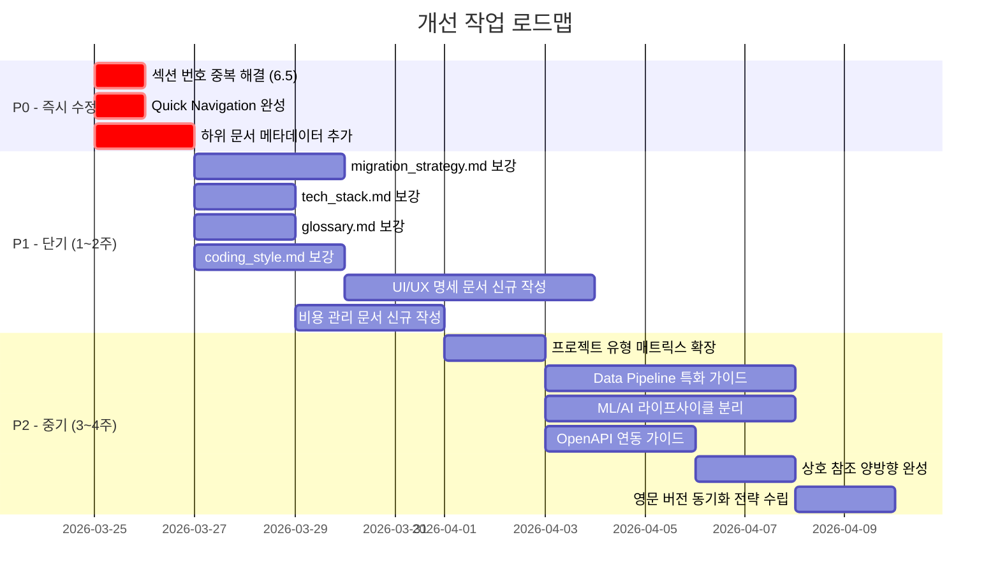

# Project Specification Template - 종합 평가 및 분석 리포트

> **평가 일자**: 2026-03-24  
> **평가 대상**: `docs/` 디렉토리 내 전체 개발 명세서 (21개 문서)  
> **평가자**: AI Code Review Agent  
> **평가 기준**: 구조적 완성도, 내용 깊이, 업계 표준, 시각화, 상호 참조, 재사용성, 일관성, 커버리지

---

## 1. 문서 구조 전체 맵

```
docs/
├── PROJECT_SPECIFICATION.md          ← 허브 문서 (프로젝트 유형별 매트릭스, Executive Summary)
├── 01_requirements/
│   ├── problem_and_goals.md          ← 문제 정의, OKR, KPI
│   ├── stakeholders.md               ← 이해관계자, RACI, 커뮤니케이션 계획
│   ├── functional.md                 ← Epic, User Story, Feature Matrix
│   └── non_functional.md             ← SLI/SLO, 성능 예산, 책임있는 AI
├── 02_architecture/
│   ├── system_design.md              ← High-Level Architecture, Component, Data Flow
│   ├── deployment_arch.md            ← Cloud/K8s 배포 구조
│   └── tech_stack.md                 ← 기술 스택 요약
├── 03_data/
│   ├── data_model.md                 ← ERD, 스키마, 데이터 라이프사이클
│   └── migration_strategy.md         ← 마이그레이션 전략
├── 04_api/
│   ├── api_guidelines.md             ← API 설계 원칙, 인증, 에러 모델
│   └── endpoints.md                  ← 엔드포인트 상세, Rate Limiting
├── 05_engineering/
│   ├── coding_style.md               ← 코딩 컨벤션, Git Workflow
│   └── testing_strategy.md           ← 테스트 피라미드, 품질 게이트, 성능 테스트
├── 06_operations/
│   ├── deployment_release.md         ← 카나리 배포, CI/CD, 공급망 보안
│   └── observability.md              ← 골든 시그널, 로깅, 메트릭, 알림
├── 07_risk_roadmap/
│   ├── risk_management.md            ← 위험 등록부, 비상 대응
│   ├── roadmap.md                    ← Gantt 로드맵, 마일스톤
│   └── glossary.md                   ← 용어 사전, 약어 목록
├── 08_security_privacy/
│   └── security_spec.md              ← STRIDE, 인증/인가, 데이터 보호
└── 99_appendix/
    └── references.md                 ← ADR, 참고 자료
```

**총 9개 디렉토리, 21개 마크다운 문서**

---

## 2. 종합 평가 스코어카드

| 평가 항목 | 점수 (10점) | 등급 | 핵심 근거 |
|-----------|:----------:|:----:|-----------|
| 구조적 완성도 | **9** | A | 모듈형 구조 우수, 디렉토리 분류 체계적 |
| 내용 깊이 | **7** | B | 핵심 문서 상세, 일부 문서 빈약 (migration, tech_stack, glossary) |
| 업계 표준 준수 | **9** | A | Google SRE, OWASP, Microsoft SDL, C4 Model 적극 참조 |
| 시각화/다이어그램 | **9** | A | Mermaid로 flowchart, sequence, ERD, gantt, quadrant 활용 |
| 상호 참조/네비게이션 | **7** | B | 기본 크로스 레퍼런스 있으나 허브 Quick Nav 불완전 |
| 재사용성/범용성 | **8** | B+ | 프로젝트 유형별 매트릭스, [TODO] 커스터마이징 구조 |
| 일관성 | **7** | B | 섹션 번호 중복, 메타데이터 불일치, 내용 중복 분산 |
| 커버리지 | **7** | B | 핵심 영역 커버, UI/UX·비용·접근성·i18n 등 누락 |

### 총점: **63 / 80** (78.8점, **B+ 등급**)

---

## 3. 강점 분석 (Strengths)

### 3.1 우수한 모듈형 구조 설계
- 단일 거대 문서가 아닌 **기능별 분리된 모듈형 구조**를 채택하여 유지보수성과 탐색성이 뛰어남
- 각 문서가 독립적으로 읽힐 수 있으면서도 허브 문서를 통해 전체 맥락을 제공
- 프로젝트 유형별(Web App, API/Backend, ML/AI, Data Pipeline, Library) **필수 섹션 매트릭스** 제공이 실용적

### 3.2 업계 표준 기반의 체계적 설계
- **Google SRE 원칙**: SLI/SLO/에러버짓, 골든 시그널 적용
- **OWASP Top 10 / Microsoft SDL**: 보안 프레임워크 적용
- **C4 Model**: 시스템 아키텍처 다이어그램 구조
- **STRIDE**: 위협 모델링 체계
- **OKR/KPI**: 측정 가능한 목표 설정 프레임워크

### 3.3 풍부한 시각화 자산
- 총 **14개 이상의 Mermaid 다이어그램**이 포함되어 시각적 이해도가 높음
- 다이어그램 유형: flowchart, sequenceDiagram, erDiagram, gantt, quadrantChart
- 부록에 Mermaid 문법 가이드까지 제공

### 3.4 실무 지향적 구성 요소
- **RACI 매트릭스**: 역할/책임 명확화
- **카나리 배포 전략**: 단계별 배포 가이드 (10% → 30% → 50% → 100%)
- **품질 게이트**: CI 파이프라인에 통합된 자동화 품질 검증
- **공급망 보안**: SBOM, 이미지 서명, 취약점 스캔 체계
- **데이터 분류 체계**: Public/Internal/Confidential/Restricted 4단계

### 3.5 개발자 경험(DX) 고려
- 각 문서 상단의 `💡 작성 가이드`로 작성 방향 제시
- `{작성 예시}` 블록으로 구체적 작성 예시 제공
- Feature Matrix를 통한 버전별 기능 로드맵 시각화
- 상태 이모지 (⚪🔵🟢✅❌)를 활용한 직관적 진행 추적

---

## 4. 발견된 문제점 (Issues)

### 4.1 [Critical] 섹션 번호 중복

**위치**: `deployment_arch.md` (6.5절) ↔ `tech_stack.md` (6.5절)

두 문서가 동일한 섹션 번호 `6.5`를 사용하고 있어 참조 시 혼란 발생.

| 문서 | 현재 번호 | 권장 수정 |
|------|-----------|-----------|
| `deployment_arch.md` | 6.4 ~ 6.5 | 6.4 (유지) |
| `tech_stack.md` | 6.5 | **6.6**으로 변경 |

### 4.2 [Critical] 허브 문서 Quick Navigation 불완전

`PROJECT_SPECIFICATION.md`의 Quick Navigation에 **6개 링크만** 포함:

```
현재 포함: requirements, architecture, data model, api spec, security, appendix
누락: engineering(코딩스타일, 테스트), operations(배포, 관측성), risk_roadmap(위험, 로드맵, 용어사전)
```

전체 21개 문서 중 **약 절반이 Quick Navigation에서 접근 불가**.

### 4.3 [Major] 문서 간 내용 깊이 편차 극심

| 문서 | 줄 수 | 평가 |
|------|------:|------|
| `system_design.md` | 166 | 매우 상세 |
| `deployment_release.md` | 120 | 매우 상세 |
| `data_model.md` | 103 | 상세 |
| `migration_strategy.md` | **18** | 매우 빈약 (3줄 요약) |
| `tech_stack.md` | **26** | 빈약 (테이블 1개) |
| `glossary.md` | **33** | 빈약 (플레이스홀더 위주) |
| `coding_style.md` | **41** | 보통 |

특히 `migration_strategy.md`는 도구명, 정책, 전략 각 1줄로만 구성되어 실질적 가이드라인으로서 기능하기 어려움.

### 4.4 [Major] 개별 문서 메타데이터 부재

허브 문서에만 Version/Status/Owner/Last Updated가 있고, **20개 하위 문서에는 메타데이터가 전혀 없음**.

```markdown
<!-- 현재: 메타데이터 없음 -->
# 🎯 Problem Statement & Goals

<!-- 권장: 각 문서 상단에 메타데이터 블록 -->
# 🎯 Problem Statement & Goals
> **Last Updated**: YYYY-MM-DD | **Status**: Draft | **Owner**: [담당자]
```

### 4.5 [Major] 프로젝트 유형 매트릭스에서 누락된 문서

허브의 프로젝트 유형별 매트릭스에 등록되지 않은 하위 문서 목록:

| 누락 문서 | 용도 |
|-----------|------|
| `tech_stack.md` | 기술 스택 요약 |
| `deployment_arch.md` | 배포 아키텍처 |
| `migration_strategy.md` | 데이터 마이그레이션 |
| `endpoints.md` | API 엔드포인트 상세 |
| `coding_style.md` | 코딩 컨벤션 |
| `glossary.md` | 용어 사전 |
| `references.md` | 부록/참고 자료 |

이 문서들은 허브에서 직접 참조되지 않아 발견하기 어려움 (부모 문서의 🔗 링크로만 접근 가능).

### 4.6 [Minor] 마이그레이션 관련 내용 분산

데이터 마이그레이션 관련 내용이 두 곳에 분산:
- `03_data/migration_strategy.md` (18줄, 전략 개요)
- `06_operations/deployment_release.md` 12.6절 (4줄, 마이그레이션 가이드)

하나로 통합하거나, 명확한 역할 분리 기준이 필요.

### 4.7 [Minor] Revision History 부재

개별 하위 문서에 변경 이력(Revision History)이 없어, 각 섹션의 변경 추적이 Git 로그에만 의존. 공동 작업 시 문서 변경 맥락 파악이 어려움.

---

## 5. 개선 제안 (Recommendations)

### 5.1 [P0 - 즉시] 구조적 결함 수정

#### 5.1.1 섹션 번호 정리
```
현재: deployment_arch.md = 6.4~6.5, tech_stack.md = 6.5
수정: deployment_arch.md = 6.4~6.5, tech_stack.md = 6.6
```

#### 5.1.2 Quick Navigation 완성
```markdown
## 🔗 Quick Navigation
- [요구사항 및 목표](./01_requirements/problem_and_goals.md)
- [이해관계자 및 RACI](./01_requirements/stakeholders.md)
- [기능 요구사항](./01_requirements/functional.md)
- [비기능 요구사항](./01_requirements/non_functional.md)
- [시스템 설계](./02_architecture/system_design.md)
- [배포 아키텍처](./02_architecture/deployment_arch.md)
- [기술 스택](./02_architecture/tech_stack.md)
- [데이터 모델](./03_data/data_model.md)
- [마이그레이션 전략](./03_data/migration_strategy.md)
- [API 가이드라인](./04_api/api_guidelines.md)
- [API 엔드포인트](./04_api/endpoints.md)
- [코딩 스타일](./05_engineering/coding_style.md)
- [테스트 전략](./05_engineering/testing_strategy.md)
- [배포 및 릴리즈](./06_operations/deployment_release.md)
- [관측성 및 모니터링](./06_operations/observability.md)
- [위험 관리](./07_risk_roadmap/risk_management.md)
- [프로젝트 로드맵](./07_risk_roadmap/roadmap.md)
- [용어 사전](./07_risk_roadmap/glossary.md)
- [보안 및 프라이버시](./08_security_privacy/security_spec.md)
- [부록 및 참고 자료](./99_appendix/references.md)
```

#### 5.1.3 각 하위 문서에 메타데이터 헤더 추가
```markdown
> **Last Updated**: [YYYY-MM-DD] | **Status**: Draft | **Owner**: [담당자]
```

---

### 5.2 [P1 - 단기] 빈약한 문서 보강

#### 5.2.1 `migration_strategy.md` 보강 제안

현재 3줄로만 구성된 마이그레이션 전략을 다음 구조로 확장:

```
- 마이그레이션 유형 분류 (Schema Migration / Data Migration / Infrastructure Migration)
- 단계별 실행 절차 (Pre-check → Dry-run → Execute → Verify → Rollback Plan)
- 후방 호환성 정책 상세 (Expand-Contract Pattern)
- 롤백 전략 플로우차트 (Mermaid)
- Zero-downtime 마이그레이션 가이드
- 대규모 데이터 마이그레이션 시 배치 처리 전략
- 마이그레이션 테스트 검증 체크리스트
```

#### 5.2.2 `tech_stack.md` 보강 제안

현재 단순 테이블만 있는 구조를 다음으로 확장:

```
- 기술 선택 근거 (ADR 연동)
- 버전 업그레이드 정책
- 기술 부채 관리 기준
- 라이선스 호환성 매트릭스
- 대안 기술 비교표
```

#### 5.2.3 `glossary.md` 보강 제안

현재 플레이스홀더만 있는 용어 사전에 다음을 추가:

```
- 도메인 용어 (비즈니스 맥락별 분류)
- 기술 용어 (시스템/인프라 관련)
- 약어 목록 확장 (현재 5개 → 문서 내 사용된 모든 약어 포함)
- 용어 간 관계 설명
```

#### 5.2.4 `coding_style.md` 보강 제안

현재 범용적인 컨벤션만 있어 다음을 추가:

```
- 언어별 상세 컨벤션 (Python: PEP 8 + 프로젝트 추가 규칙, TypeScript: 등)
- 디렉토리 구조 컨벤션
- Import 순서 규칙
- 에러 핸들링 패턴
- 코드 리뷰 체크리스트
- PR 템플릿 가이드
```

---

### 5.3 [P1 - 단기] 누락된 핵심 섹션 추가

#### 5.3.1 UI/UX 명세 문서 추가 (Web App 프로젝트용)

프로젝트 유형 매트릭스에 Web App이 포함되어 있으나 UI/UX 관련 문서가 전무.

```
추천 위치: docs/09_ux/ui_spec.md
포함 내용:
- 디자인 시스템/스타일 가이드
- 와이어프레임 참조
- 컴포넌트 라이브러리
- 접근성(A11y) 가이드 (WCAG 2.1 기준)
- 반응형 브레이크포인트
- 다크모드/테마 지원
```

#### 5.3.2 비용 관리 섹션 추가

클라우드 인프라 비용 관리가 문서 전체에서 누락.

```
추천 위치: docs/06_operations/cost_management.md
포함 내용:
- 월간 예산 추정
- 리소스별 비용 브레이크다운
- 비용 알림 임계치
- 비용 최적화 전략 (Reserved Instance, Spot, 등)
- FinOps 원칙 적용
```

#### 5.3.3 국제화(i18n)/다국어 지원 가이드

글로벌 서비스를 고려할 경우 필요.

```
추천 위치: docs/05_engineering/i18n_guide.md
포함 내용:
- 다국어 리소스 관리 전략
- 날짜/통화/숫자 포맷 가이드
- RTL 레이아웃 지원
- 번역 워크플로우
```

#### 5.3.4 변경 관리(Change Management) 프로세스

기능 변경/요구사항 변경 시 프로세스가 문서화되어 있지 않음.

```
추천 위치: docs/07_risk_roadmap/change_management.md
포함 내용:
- 변경 요청(CR) 프로세스
- 영향도 분석 절차
- 승인 워크플로우
- 긴급 변경 절차
```

---

### 5.4 [P2 - 중기] 문서 품질 향상

#### 5.4.1 프로젝트 유형 매트릭스 확장

현재 매트릭스에 누락된 7개 문서를 반영하여 확장:

| 섹션 | Web App | API | ML/AI | Pipeline | Library |
|------|:-------:|:---:|:-----:|:--------:|:-------:|
| Tech Stack | ✅ | ✅ | ✅ | ✅ | ✅ |
| Deployment Arch. | ✅ | ✅ | ✅ | ✅ | ⚪ |
| Migration Strategy | ✅ | ✅ | ⚪ | ✅ | ⚪ |
| API Endpoints | ⚪ | ✅ | ⚪ | ⚪ | ✅ |
| Coding Style | ✅ | ✅ | ✅ | ✅ | ✅ |
| Glossary | ✅ | ✅ | ✅ | ✅ | ✅ |
| References/ADR | ✅ | ✅ | ✅ | ✅ | ✅ |

#### 5.4.2 OpenAPI/Swagger 스펙 연동 가이드

`api_guidelines.md`에 OpenAPI 스펙 파일 관리 가이드 추가:

```
- OpenAPI 3.0+ 스펙 파일 위치 및 관리 방법
- 코드-퍼스트 vs 스펙-퍼스트 전략
- 자동 문서 생성 도구 (Swagger UI, Redoc)
- API 스펙과 구현 간 동기화 전략
- Contract Testing과의 연동
```

#### 5.4.3 Data Pipeline 프로젝트 특화 가이드

프로젝트 유형 매트릭스에 Data Pipeline이 있으나 관련 전문 가이드가 부재.

```
추천 위치: docs/03_data/pipeline_spec.md
포함 내용:
- ETL/ELT 파이프라인 설계 패턴
- 데이터 품질 검증 규칙 (Great Expectations 등)
- 스케줄링 전략 (Airflow DAG 구조)
- 데이터 리니지(Lineage) 추적
- 배치 vs 스트리밍 선택 기준
- 재처리(Backfill) 전략
```

#### 5.4.4 ML/AI 프로젝트 특화 가이드 분리

현재 `non_functional.md`의 5.5절에 간략히만 포함된 Responsible AI 내용을 독립 문서로 분리.

```
추천 위치: docs/10_ml_ai/ml_lifecycle.md
포함 내용:
- 모델 학습/평가/배포 라이프사이클
- Feature Store 설계
- 모델 버저닝 및 레지스트리
- A/B 테스트 / Shadow 배포
- 모델 모니터링 (Drift Detection)
- Responsible AI (현재 5.5절 내용 확장)
```

---

### 5.5 [P2 - 중기] 일관성 개선

#### 5.5.1 영문 버전(PROJECT_SPECIFICATION_EN.md) 동기화 관리

영문/한글 이중 버전 관리 시 동기화 문제가 발생할 수 있음.

```
권장 방안:
1. 하나의 언어를 원본(Source of Truth)으로 지정
2. 번역 자동화 또는 번역 체크리스트 관리
3. 양쪽 문서에 "원본 언어" 및 "마지막 동기화 일자" 명시
4. 또는 단일 언어로 통합하고, 필요 시 자동 번역 도구 연동
```

#### 5.5.2 상호 참조 양방향 완성

현재 일부 문서에서 역방향 참조가 누락. 예:

| 문서 A → 문서 B | 역참조 (B → A) 여부 |
|-----------------|:-------------------:|
| `coding_style.md` → `testing_strategy.md` | ✅ |
| `testing_strategy.md` → `coding_style.md` | ✅ |
| `api_guidelines.md` → `endpoints.md` | ✅ |
| `api_guidelines.md` → `security_spec.md` | ✅ |
| `security_spec.md` → `api_guidelines.md` | ✅ |
| `coding_style.md` → `api_guidelines.md` | ❌ 누락 |
| `observability.md` → `security_spec.md` | ❌ 누락 |
| `risk_management.md` → `security_spec.md` | ❌ 누락 |

---

## 6. 문서별 상세 평가

| # | 문서 | 줄 수 | 깊이 | 시각화 | 상호참조 | 종합 |
|---|------|------:|:----:|:------:|:--------:|:----:|
| 1 | `PROJECT_SPECIFICATION.md` | 79 | ★★★ | - | ★★☆ | B |
| 2 | `problem_and_goals.md` | 64 | ★★★ | - | ★★★ | A- |
| 3 | `stakeholders.md` | 52 | ★★★ | - | ★★★ | A- |
| 4 | `functional.md` | 82 | ★★★ | - | ★★★ | A- |
| 5 | `non_functional.md` | 99 | ★★★ | - | ★★★ | A |
| 6 | `system_design.md` | 166 | ★★★ | ★★★ | ★★★ | **A+** |
| 7 | `deployment_arch.md` | 102 | ★★★ | ★★★ | ★★☆ | A |
| 8 | `tech_stack.md` | 26 | ★☆☆ | - | ★★☆ | **C** |
| 9 | `data_model.md` | 103 | ★★★ | ★★★ | ★★★ | A |
| 10 | `migration_strategy.md` | 18 | ★☆☆ | - | ★★☆ | **D** |
| 11 | `api_guidelines.md` | 91 | ★★★ | - | ★★★ | A |
| 12 | `endpoints.md` | 63 | ★★☆ | - | ★★★ | B+ |
| 13 | `coding_style.md` | 41 | ★★☆ | - | ★★☆ | B- |
| 14 | `testing_strategy.md` | 91 | ★★★ | ★★☆ | ★★★ | A |
| 15 | `deployment_release.md` | 120 | ★★★ | ★★★ | ★★★ | **A+** |
| 16 | `observability.md` | 100 | ★★★ | - | ★★☆ | A- |
| 17 | `risk_management.md` | 72 | ★★★ | ★★★ | ★★★ | A |
| 18 | `roadmap.md` | 73 | ★★★ | ★★★ | ★★★ | A |
| 19 | `glossary.md` | 33 | ★☆☆ | - | ★★☆ | C+ |
| 20 | `security_spec.md` | 78 | ★★★ | - | ★★★ | A- |
| 21 | `references.md` | 52 | ★★☆ | - | ★★☆ | B |

> ★★★ 우수 | ★★☆ 보통 | ★☆☆ 미흡

---

## 7. 우선순위별 개선 로드맵



---

## 8. 최종 결론

본 프로젝트 명세서 템플릿은 **소프트웨어 개발 프로젝트의 핵심 영역을 체계적으로 커버하는 우수한 모듈형 구조**를 갖추고 있습니다. Google SRE, OWASP, Microsoft SDL 등 **업계 표준을 적극 참조**하고 있으며, **Mermaid 다이어그램을 활용한 시각화**가 문서의 이해도를 크게 높이고 있습니다.

다만 다음 세 가지 영역에서 개선이 필요합니다:

1. **즉시 수정이 필요한 구조적 결함** — 섹션 번호 중복, Quick Navigation 불완전, 메타데이터 부재
2. **빈약한 문서 보강** — `migration_strategy.md`, `tech_stack.md`, `glossary.md`, `coding_style.md`의 내용 확장
3. **커버리지 확장** — UI/UX, 비용 관리, Data Pipeline 특화, ML/AI 라이프사이클 등 누락 영역 추가

이러한 개선이 완료되면 **B+ → A 등급**으로 품질 향상이 기대됩니다.

---

> **Note**: 본 리포트는 템플릿 구조 자체를 평가한 것이며, [TODO] 플레이스홀더에 실제 프로젝트 내용이 채워진 후에는 별도의 내용 검증이 필요합니다.
