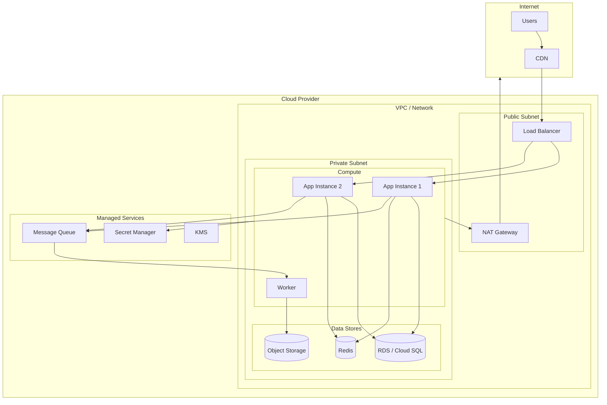
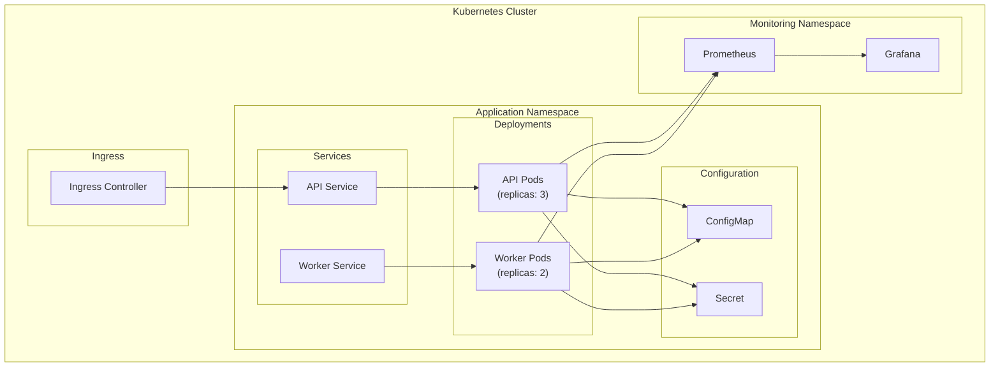

# 🚀 Deployment Architecture

> **Last Updated**: [YYYY-MM-DD] | **Status**: Draft | **Owner**: [담당자]

> 💡 **작성 가이드**: 인프라 배포 구조를 표현합니다.

---

## Cloud Deployment Architecture

---

## Kubernetes Deployment (Optional)

---

## 🔗 관련 문서
- [시스템 디자인 (System Design)](./system_design.md)
- [기술 스택 요약 (Tech Stack)](./tech_stack.md)
- [비용 관리 (FinOps)](../06_operations/cost_management.md)
- [Infrastructure as Code](../06_operations/infrastructure_as_code.md)
