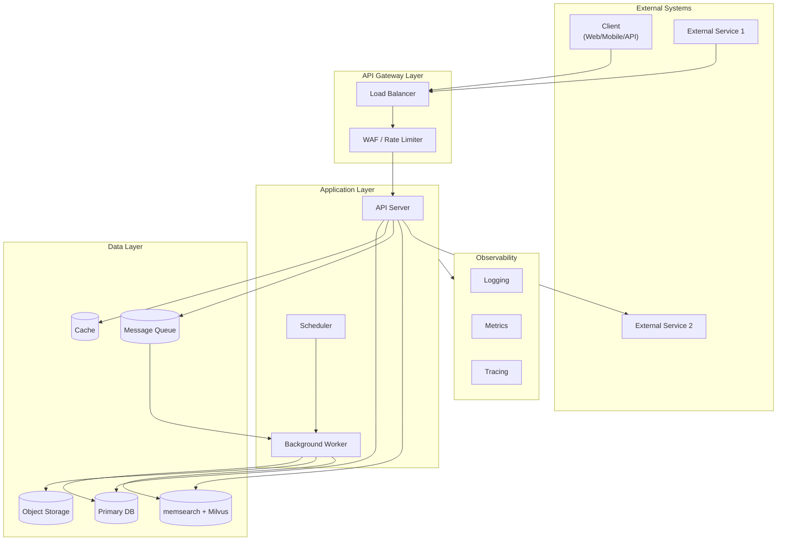
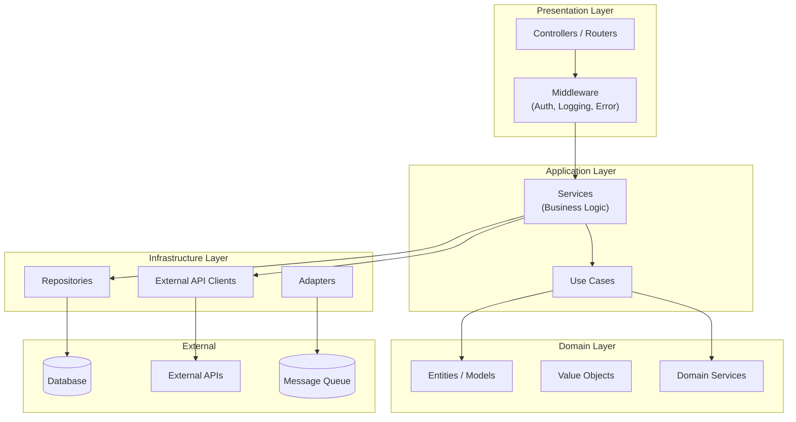
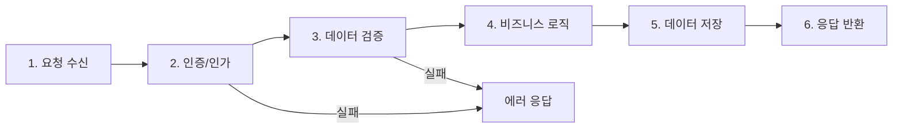
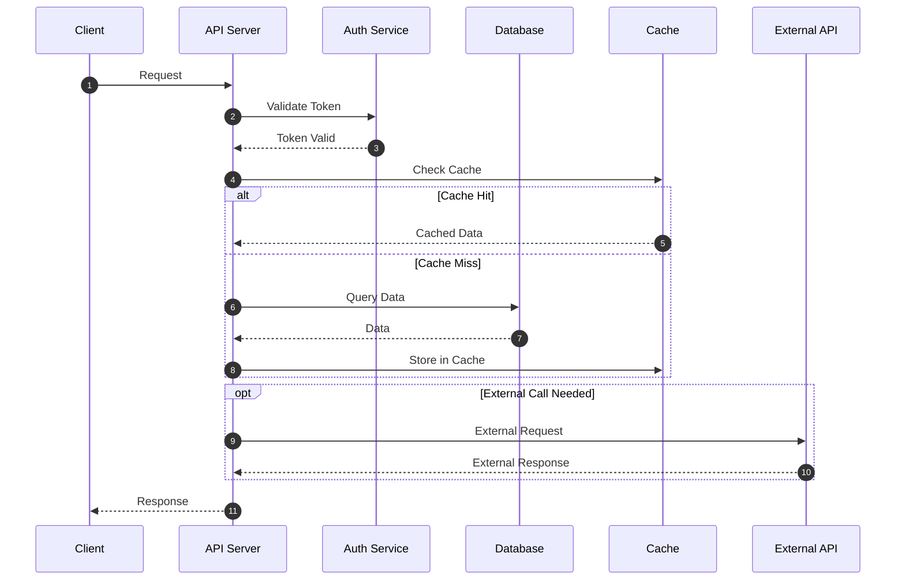

# 🏗️ System Design

> 💡 **작성 가이드**: 시스템 구조를 다양한 관점에서 시각화합니다. (C4 Model 권장)

---

## 6.1 High-Level Architecture

> 💡 **작성 가이드**: 전체 시스템의 주요 구성요소와 외부 시스템 연동을 표현합니다.

---

## 6.2 Component Diagram

> 💡 **작성 가이드**: 애플리케이션 내부의 레이어/모듈 구조를 표현합니다.

---

## 6.3 Data Flow Diagram

> 💡 **작성 가이드**: 주요 데이터의 흐름을 시퀀스 또는 플로우차트로 표현합니다.

#### 6.3.1 주요 플로우 (Flowchart)

#### 6.3.2 상세 시퀀스 (Sequence Diagram)

---

## 🔗 관련 문서
- [배포 아키텍처 (Deployment)](./deployment_arch.md)
- [기술 스택 요약 (Tech Stack)](./tech_stack.md)
- [데이터 모델 (Data Model)](../03_data/data_model.md)
- [Agent Long-term Memory (memsearch)](../03_data/memsearch_memory.md)
