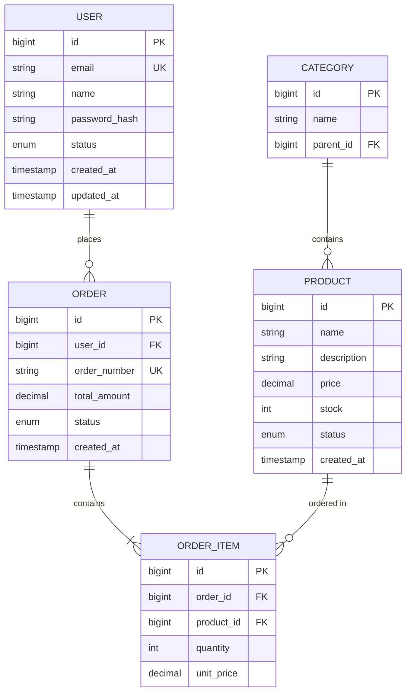

# 💾 Data Model & Schema

> 💡 **작성 가이드**: 데이터 구조와 관계를 정의합니다.

---

## 7.1 Entity Relationship Diagram

> 💡 **작성 가이드**: Mermaid erDiagram을 사용하여 ERD를 작성합니다.



---

## 7.2 테이블/컬렉션 스키마 상세

#### [Entity 명] 테이블

```sql
-- {예시: SQL DDL}
CREATE TABLE [table_name] (
    id              BIGINT PRIMARY KEY AUTO_INCREMENT,
    [field_1]       VARCHAR(255) NOT NULL,
    [field_2]       TEXT,
    [status]        ENUM('active', 'inactive') DEFAULT 'active',
    created_at      TIMESTAMP DEFAULT CURRENT_TIMESTAMP,
    updated_at      TIMESTAMP DEFAULT CURRENT_TIMESTAMP ON UPDATE CURRENT_TIMESTAMP,
    
    INDEX idx_[field_1] ([field_1]),
    INDEX idx_created_at (created_at)
) ENGINE=InnoDB DEFAULT CHARSET=utf8mb4;
```

| 컬럼 | 타입 | 필수 | 설명 |
|------|------|:----:|------|
| id | BIGINT | ✅ | Primary Key |
| [field_1] | VARCHAR(255) | ✅ | [설명] |
| [field_2] | TEXT | ❌ | [설명] |

---

## 7.3 데이터 라이프사이클

| 데이터 유형 | 보존 기간 | 삭제 조건 | 백업 주기 |
|-------------|-----------|-----------|-----------|
| [유형 1] | 영구 | 명시적 요청 | Daily |
| [유형 2] | 90일 | TTL 자동 삭제 | N/A |
| [유형 3] | 1년 | 연간 정리 | Weekly |

---

## 🔗 관련 문서
- [마이그레이션 전략 (Migration)](./migration_strategy.md)
- [시스템 디자인 (System Design)](../02_architecture/system_design.md)
