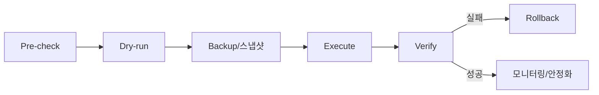

# 🔄 Data Migration Strategy

> **Last Updated**: [YYYY-MM-DD] | **Status**: Draft | **Owner**: [담당자]

> 💡 **작성 가이드**: 스키마/데이터 마이그레이션을 무중단·롤백 가능하게 수행하기 위한 정책과 절차를 정의합니다. 각 마이그레이션은 PR 단위로 이 문서의 체크리스트를 충족해야 합니다.

---

## 7.4 마이그레이션 유형 분류

| 유형 | 설명 | 대표 도구 | 위험도 |
|------|------|-----------|:------:|
| Schema Migration | 테이블/컬럼/인덱스 등 DDL 변경 | [Alembic / Flyway / Liquibase 등] | M~H |
| Data Migration | 행 단위 값 변환/이관(backfill 포함) | [배치 스크립트 / dbt 등] | M |
| Infrastructure Migration | DB 엔진/버전/리전 이전 | [DMS / pg_dump 등] | H |

---

## 7.5 후방 호환성 — Expand / Contract 패턴

파괴적 변경을 한 번에 적용하지 않고 단계로 나눠 무중단을 보장한다.

1. **Expand**: 새 컬럼/테이블을 nullable 또는 기본값과 함께 **추가만** 한다. 기존 코드와 공존 가능해야 한다.
2. **Migrate(Backfill)**: 신구 양쪽에 동시 기록(dual-write)하거나 배치로 과거 데이터를 채운다.
3. **Switch**: 애플리케이션이 새 구조를 읽도록 전환한다.
4. **Contract**: 구 컬럼/테이블을 제거한다. (전환 안정화 후 별도 릴리스)

> 컬럼 삭제·타입 변경·NOT NULL 추가는 절대 단일 릴리스에서 수행하지 않는다.

---

## 7.6 표준 실행 절차

- **Pre-check**: 대상 테이블 row 수, 락 영향, 예상 소요시간, 디스크 여유 확인.
- **Dry-run**: 스테이징에서 동일 마이그레이션 실행 + 소요시간/락 측정.
- **Backup**: 실행 직전 스냅샷/백업 시점 기록. (복구 지점 명시)
- **Execute**: 점검 윈도/저트래픽 시간대. 대용량은 배치 청크로 분할.
- **Verify**: 7.8 검증 체크리스트 통과.
- **Rollback**: 7.7 전략에 따라 복구.

---

## 7.7 롤백 전략

| 상황 | 롤백 방법 |
|------|-----------|
| Expand 단계 실패 | 추가분 DROP (데이터 영향 없음) |
| Backfill 중 실패 | 멱등 재실행 또는 체크포인트부터 재개 |
| Switch 후 오류 | 애플리케이션을 구 구조 읽기로 즉시 롤백(코드 플래그) |
| Contract 후 오류 | 백업 복원 (가장 비용 큼 → Contract는 충분한 안정화 후) |

- 롤백 트리거 임계치: [에러율/지연 임계 — 예: 5xx > 1% 5분 지속]
- 롤백 의사결정자: [담당자]

---

## 7.8 검증 체크리스트 (Verify)

- [ ] 마이그레이션 전/후 row count 일치(또는 예상 증감과 일치)
- [ ] 신규 제약(PK/FK/Unique/Index) 적용 확인
- [ ] 샘플링 검증: 무작위 N건의 변환 결과 정합성
- [ ] 애플리케이션 헬스체크/핵심 쿼리 p95 지연 정상
- [ ] 복제 지연(replication lag) 정상 범위
- [ ] 롤백 스크립트가 스테이징에서 실제로 동작함을 확인

---

## 7.9 대용량 / Backfill 처리

- **청크 분할**: PK 범위 기준 [배치 크기] 단위로 처리, 배치 간 [지연]으로 부하 제어.
- **멱등성**: 재실행 시 중복 적용되지 않도록 `WHERE` 조건 또는 처리 마커 사용.
- **체크포인트**: 마지막 처리 PK/offset을 저장해 중단 후 재개 가능하게 한다.
- **모니터링**: 진행률, 에러 건수, DB 부하를 실시간 관측. (→ [관측성](../06_operations/observability.md))

---

## 🔗 관련 문서
- [데이터 모델 및 스키마 (Data Model)](./data_model.md)
- [데이터 파이프라인 (Pipeline)](./pipeline_spec.md)
- [배포 및 릴리즈 (Deployment)](../06_operations/deployment_release.md)
- [위험 관리 (Risk)](../07_risk_roadmap/risk_management.md)
