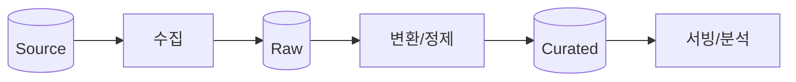

# 🔀 Data Pipeline Spec

> **Last Updated**: [YYYY-MM-DD] | **Status**: Draft | **Owner**: [담당자]

> 💡 **작성 가이드**: ETL/ELT 데이터 파이프라인의 설계·품질·운영 기준을 정의합니다. (Data Pipeline / ML 유형 프로젝트 필수, 그 외 선택)

---

## 7a.1 파이프라인 개요

- **소스**: [DB/API/파일/스트림]
- **저장 계층**: Raw → Refined → Curated (예: GCS 버킷/BigQuery 데이터셋 분리)
- **처리 방식**: [Batch / Streaming / Micro-batch] 및 선택 기준

---

## 7a.2 스케줄링 / 오케스트레이션

| 항목 | 내용 |
|------|------|
| 오케스트레이터 | [Airflow / Dagster / Cloud Composer 등] |
| 트리거/주기 | [cron / 이벤트 / 센서] |
| Task 의존성 | [DAG 구조 요약] |
| 동시성/재시도 | [최대 동시 실행, 재시도/백오프] |

---

## 7a.3 데이터 품질 (Data Quality)

- 검증 도구: [Great Expectations / dbt test / 커스텀]
- 필수 체크: [스키마 일치, 결측치 임계, 유니크/범위, 행 수 이상치]
- 실패 정책: [차단(fail) / 격리(quarantine) / 경고]

---

## 7a.4 멱등성 / 재처리 (Backfill)

- 각 실행은 멱등(같은 파티션 재실행 시 중복 없음 — 파티션 overwrite 또는 upsert).
- **Backfill**: [기간 파라미터화], 운영 부하를 고려한 청크/병렬도 제한.
- **체크포인트**: 처리 완료 파티션/offset 기록으로 중단 후 재개.

---

## 7a.5 파티셔닝 / 성능

- 파티셔닝: [날짜/키 기준], 클러스터링: [컬럼].
- 대용량: [청크 분할, multiprocessing/asyncio 등] 전략.

---

## 7a.6 리니지 / 관측성

- 데이터 리니지 추적: [도구/방법]
- 파이프라인 SLA: 신선도(freshness) [목표], 지연 알림 임계치(→ [관측성](../06_operations/observability.md)).

---

## 🔗 관련 문서
- [데이터 모델](./data_model.md)
- [마이그레이션 전략](./migration_strategy.md)
- [관측성](../06_operations/observability.md)
