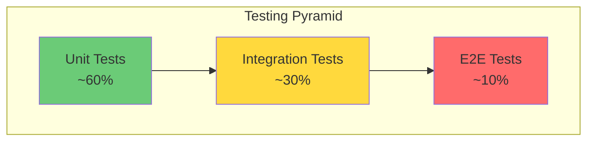

# 🧪 Testing Strategy

> **Last Updated**: [YYYY-MM-DD] | **Status**: Draft | **Owner**: [담당자]

> 💡 **작성 가이드**: 테스트 피라미드 원칙에 따라 전략을 수립합니다.

---

## 10.1 테스트 피라미드



---

## 10.2 테스트 유형별 전략

| 유형 | 도구 | 커버리지 목표 | 실행 시점 |
|------|------|:-------------:|-----------|
| Unit Test | [pytest/jest/등] | ≥ 80% | Pre-commit, PR |
| Integration Test | [도구] | 주요 플로우 | PR, Daily |
| Contract Test | [도구] | API 100% | PR |
| E2E Test | [Playwright/Cypress] | Critical Path | Daily |
| Load Test | [k6/Locust] | SLO 검증 | Weekly |
| Security Test | [도구] | - | Weekly |

---

## 10.3 품질 게이트 (CI Pipeline)

```yaml
quality_gate:
  - name: Type Check
    tool: [pyright/tsc/등]
    threshold: 0 errors
    
  - name: Lint
    tool: [ruff/eslint/등]
    threshold: 0 errors
    
  - name: Security
    tool: [bandit/snyk/등]
    threshold: 0 high/critical
    
  - name: Coverage
    tool: [pytest-cov/jest/등]
    threshold: ≥ 80%
    trend: non-decreasing
```

---

## 10.4 테스트 환경

| 환경 | 용도 | 데이터 |
|------|------|--------|
| Local | 개발자 테스트 | Mock/Fixture |
| CI | 자동화 테스트 | Testcontainers |
| Staging | 통합/E2E | 익명화된 샘플 |

---

## 10.5 성능 테스트 시나리오

```yaml
scenarios:
  - name: [시나리오명]
    endpoint: [METHOD] [PATH]
    vus: [동시 사용자 수]
    duration: [테스트 시간]
    thresholds:
      http_req_duration: ['p95<[X]', 'p99<[X]']
      http_req_failed: ['rate<0.01']
```

---

## 🔗 관련 문서
- [코드 스타일 가이드 (Coding Style)](./coding_style.md)
- [시스템 아키텍처 (System Design)](../02_architecture/system_design.md)
