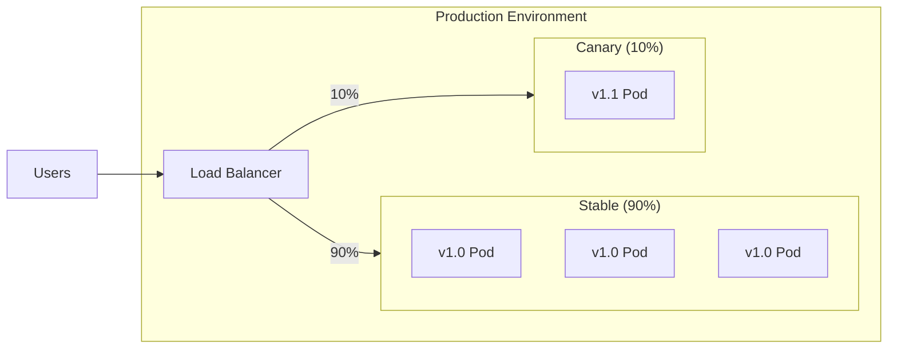
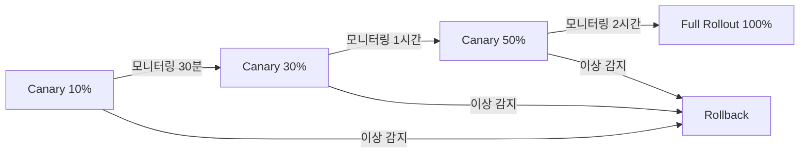
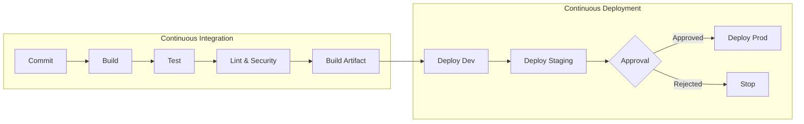

# 🚀 Deployment & Release

> **Last Updated**: [YYYY-MM-DD] | **Status**: Draft | **Owner**: [담당자]

> 💡 **작성 가이드**: 안전하고 신뢰할 수 있는 배포 전략을 정의합니다.

---

## 배포 전략

#### 카나리 배포 (Canary)

**배포 단계:**

#### 대안 전략 (Blue-Green 등)

| 전략 | 설명 | 사용 시기 |
|------|------|-----------|
| Blue-Green | 전체 교체, 빠른 롤백 | 대규모 변경 |
| Rolling | 점진적 인스턴스 교체 | 일반 배포 |
| Feature Flag | 기능 단위 제어 | 실험, A/B 테스트 |

---

## 롤백 기준

| 조건 | 임계치 | 자동 롤백 |
|------|--------|:---------:|
| 에러율 증가 | > [X]% (baseline 대비) | ✅/❌ |
| p95 지연 증가 | > [X]% (baseline 대비) | ✅/❌ |
| SLO 번레이트 | > [X]%/시간 | ✅/❌ |
| Health Check 실패 | > [X]% | ✅/❌ |

---

## 환경 구성

| 환경 | 용도 | 자동 배포 | 승인 필요 |
|------|------|:---------:|:---------:|
| Development | 개발/테스트 | ✅ | ❌ |
| Staging | 통합 테스트 | ✅ | ❌ |
| Production | 운영 | ❌ | ✅ |

---

## CI/CD Pipeline

---

## 공급망 보안

| 항목 | 구현 | 도구 |
|------|------|------|
| SBOM 생성 | 빌드 시 생성 | [syft/등] |
| 종속성 고정 | Lock 파일 사용 | [pip-tools/yarn/등] |
| 이미지 서명 | 서명 및 검증 | [cosign/등] |
| 취약점 스캔 | 빌드/배포 시 | [trivy/snyk/등] |

---

## 마이그레이션 가이드 (DB)
- 후방 호환성 유지 ([X]버전)
- 드라이런 필수 실행
- 롤백 스크립트 준비
- 피크 시간 외 실행

---

## memsearch 배포 체크리스트

- [ ] memsearch 버전 고정 및 변경 로그 확인
- [ ] Milvus 컬렉션/인덱스 스키마 호환성 확인
- [ ] 재색인 필요 여부 판단 및 백필 계획 수립
- [ ] 메모리 쓰기 실패 폴백 경로 검증
- [ ] 배포 후 `memory_recall_hit_ratio`, `memory_recall_latency_seconds` 모니터링

---

## 자율 배포 정책 (Agent)

에이전트 자율 실행 시 배포 경계(→ [에이전트 운영 모델](../10_agent_ops/operating_model.md)):

- **dev/staging**: 자율 배포 + 스모크 테스트 자동 수행 허용.
- **prod**: 🚫 에이전트 직접 배포 금지. CI/CD에 **Manual Approval Gate**를 명시 — 사람이 영향도·롤백 런북 검토 후 승인.
- **prod 크레덴셜**: 에이전트 실행 환경에 주입하지 않는다. 에이전트는 prod용 PR/Release를 준비만 한다.
- **롤백**: 자동 트리거(에러율/지연 임계)는 허용하며, 위 카나리/롤백 기준을 따른다.

## 🔗 관련 문서
- [에이전트 운영 모델](../10_agent_ops/operating_model.md)
- [관측성 및 모니터링 (Observability)](./observability.md)
- [데이터 마이그레이션 전략 (Migration)](../03_data/migration_strategy.md)
- [Agent Long-term Memory (memsearch)](../03_data/memsearch_memory.md)
- [Infrastructure as Code](./infrastructure_as_code.md)
