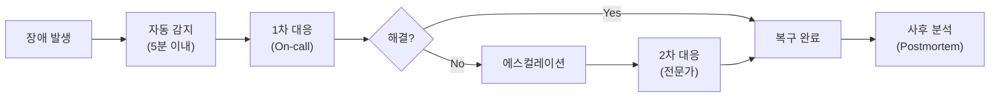

# ⚠️ Risk Management

> **Last Updated**: [YYYY-MM-DD] | **Status**: Draft | **Owner**: [담당자]

> 💡 **작성 가이드**: 프로젝트 위험을 사전에 식별하고 완화 전략을 수립합니다.

---

## 13.1 위험 등록부 (Risk Register)

| ID | 위험 | 영향도 | 발생 확률 | 위험 점수 | 완화 전략 | 담당자 |
|----|------|:------:|:---------:|:---------:|-----------|--------|
| R-001 | [위험 1] | H/M/L | H/M/L | 🔴/🟠/🟡/🟢 | [전략] | [담당] |
| R-002 | [위험 2] | H/M/L | H/M/L | 🔴/🟠/🟡/🟢 | [전략] | [담당] |

---

## 13.2 위험 점수 매트릭스

```mermaid
quadrantChart
    title Risk Matrix
    x-axis Low Impact --> High Impact
    y-axis Low Probability --> High Probability
    quadrant-1 High Risk (Mitigate)
    quadrant-2 Medium Risk (Monitor)
    quadrant-3 Low Risk (Accept)
    quadrant-4 Medium Risk (Transfer)
```

> **참고**: 위험 점수 = 영향도 × 발생 확률
> - 🔴 High (6-9): 즉시 대응 필요
> - 🟠 Medium (3-5): 완화 계획 수립
> - 🟡 Low (1-2): 모니터링
> - 🟢 Minimal: 수용

---

## 13.3 비상 대응 계획 (Contingency Plan)

#### 시나리오: [주요 장애 시나리오]



**대응 절차:**
1. [절차 1]
2. [절차 2]
3. [절차 3]

---

## 13.4 의존성 위험

| 의존성 | 위험 수준 | 대안 | 전환 비용 |
|--------|:---------:|------|:---------:|
| [의존성 1] | 🟠/🟡/🟢 | [대안] | H/M/L |
| [의존성 2] | 🟠/🟡/🟢 | [대안] | H/M/L |

---

## 🔗 관련 문서
- [프로젝트 로드맵 (Roadmap)](./roadmap.md)
- [품질 게이트 (Quality Gate)](../05_engineering/testing_strategy.md)
