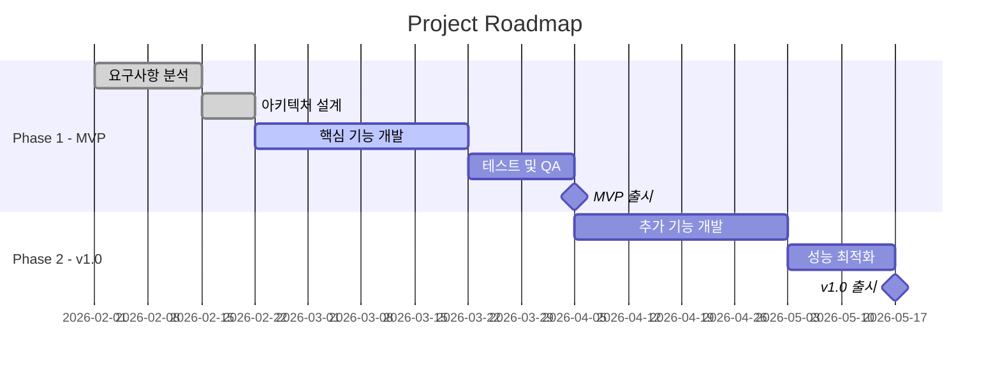
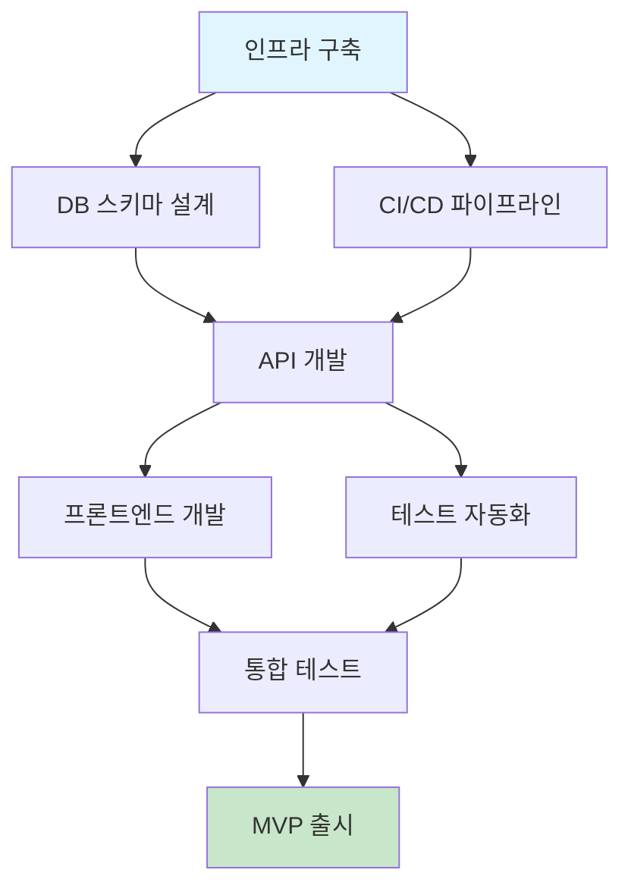

# 📅 Roadmap & Milestones

> 💡 **작성 가이드**: 프로젝트 일정과 마일스톤을 정의합니다.

---

## 14.1 전체 로드맵

---

## 14.2 마일스톤 상세

#### Milestone 1: [마일스톤 명] (목표일: [YYYY-MM-DD])

| Phase | Task | Owner | 상태 |
|:-----:|------|-------|:----:|
| 1 | [태스크 1] | [담당] | ⚪/🔵/🟢/✅ |
| 2 | [태스크 2] | [담당] | ⚪/🔵/🟢/✅ |
| 3 | [태스크 3] | [담당] | ⚪/🔵/🟢/✅ |

> 상태: ⚪ Not Started | 🔵 Planning | 🟢 In Progress | ✅ Done

**완료 기준 (Definition of Done):**
- [ ] [기준 1]
- [ ] [기준 2]
- [ ] [기준 3]

---

## 14.3 의존관계 다이어그램

---

## 🔗 관련 문서
- [위험 관리 (Risk Management)](./risk_management.md)
- [용어 사전 (Glossary)](./glossary.md)
