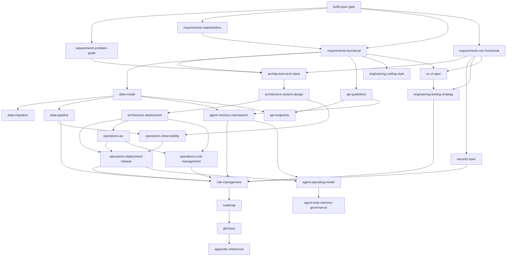

# Development Project Skill Graph

## Root

- Root Spec: `BUILD_SPEC_TEMPLATE.md`
- Root Skill: `build-spec-gate`

## Graph (Mermaid)

> `agent-operating-model` → `agent-loop-memory-governance`는 명세를 **에이전트가 실행하는 방법**(반자율 운영)을 정의하는 실행 레이어다. 명세 완성(위 그래프) 이후 적용한다.

## Execution Order (Recommended)

1. `build-spec-gate`
2. `requirements-*`
3. `architecture-*`
4. `data-*` (`data-model` -> `data-migration` / `data-pipeline`) + `api-*`
5. `agent-memory-memsearch`
6. `engineering-*` + `ux-ui-spec` + `security-spec`
7. `operations-*` (`observability` / `deployment-release` / `iac` / `cost-management`)
8. `risk-management` -> `roadmap` -> `glossary` -> `appendix-references`
9. (실행 레이어) `agent-operating-model` -> `agent-loop-memory-governance` — 명세 완성 후, 에이전트 반자율 실행 규칙 적용
